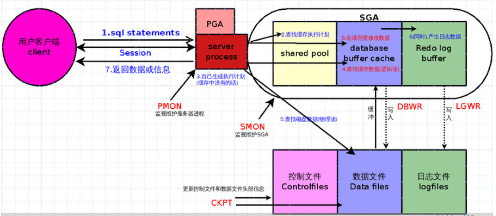
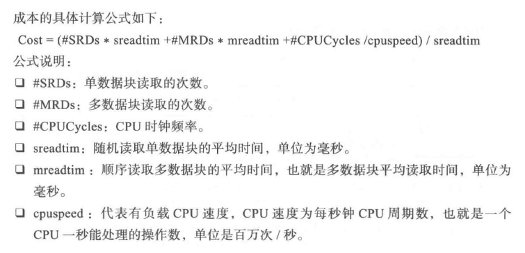
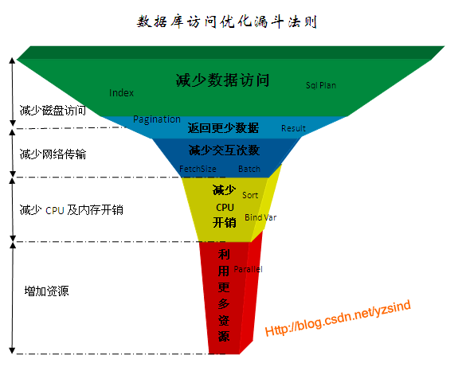
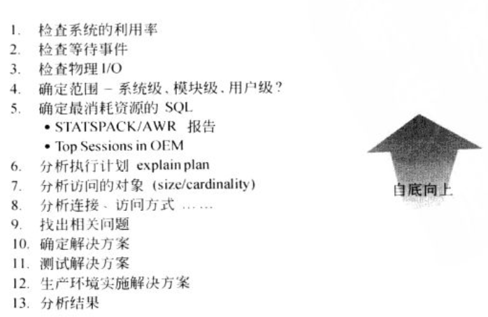

# SQL优化思路-Oracle篇

**为什么要重点提及SQL优化？**

关于SQL优化的教程很多，也是结合了各种资料以及书籍进行整理。下面给大家分享一下。

作为程序员经常和数据库打交道的时候还是非常频繁的，掌握住一些Sql的优化技巧还是非常有必要的。下面列出一些常用的SQl优化技巧。

`在工作中发现在数据库方面的一些现象`：

1. **开发人员将数据库视为“黑盒子”**，开发人员不关心，不重视SQL的执行过程，只关注具体的应用层体现。

2. **对SQL质量的重视程度不够**,我们在日常项目中通常是不重视SQL的执行,没有经过大数量的反复推敲。

   通常是直到项目上线，甚至到出现性能问题时，才会重点关注分析。或者是有DBA介人处理。这种救火模式，往往效果不好，即使有了解决方案，其代价、成本也必然是巨大的。

3. **开发人员想提高，但是无从下手**。有部分开发人员意识到了SQL语句的重要性，但是无从下手。可能只是靠自我的日常积累。导致我们想提高缺困难重重！

`场景误区`：

1. **关系数据库已死**，近些年来，随着NoSQL的发展盛兴和推广，有一种观点就是关系数据库必将死亡，NoSQL将取而代之！随之而来的就是SQL优化没有必要，NoSQL作为一种新兴的技术，的确有其鲜明的特点，也适用于一些场合。但我们要看到，很多需要ACID的场景下，传统数据库仍然是不二选择，不可取代。

2. **SQL优化很简单**,有些人认为，SQL优化很简单，部分人观点SQL优化不就是加几个索引嘛，有啥难的！

   但其不是唯一的。且很多情况下，加了索引可能导致性能更差。在我们真实的项目中观察到单表存在10多个索引的情况。

3. **SQL优化只是DBA的事情**,在我们的开发过程中，只关注自身的业务功能实现而忽略了相应的执行成本。

   最终就导致上线后系统运行缓慢，代码质量不够。客户体验较差等问题。

## SQL语句的执行顺序

> **SQL Select语句完整的执行顺序**
>
> 1. from子句组装来自不同数据源的数据；
> 2. where子句基于指定的条件对记录行进行筛选；
> 3. group by子句将数据划分为多个分组；
> 4. 使用聚集函数进行计算；
> 5. 使用having子句筛选分组；
> 6. 计算所有的表达式；
> 7. 使用order by对结果集进行排序。
> 8. select 集合输出。

| 序号 | 语法顺序         | 加载顺序 |
| ---- | ---------------- | -------- |
| 1    | SELECT[DISTINCT] | FROM     |
| 2    | FROM             | WHERE    |
| 3    | WHERE            | GROUP BY |
| 4    | GROUP BY         | HAVING   |
| 5    | HAVING           | SELECT   |
| 6    | UNION            | DISTINCT |
| 7    | ORDER BY         | UNION    |
| 8    |                  | ORDER BY |

## 理解SQL执行原理和过程

- **客户端把语句发给服务器端执行**

  ​		当我们在客户端执行 select 语句时,客户端会把这条 SQL 语句发送给服务器端,让服务器端的进程来处理这语句。

- **语句解析**

  > 1. 查询高速缓存(library cache)。服务器进程在接到客户端传送过来的 SQL 语句时,不会直接去数据库查询。而是会先在数据库的高速缓存中去查找,是否存在相同语句的执行计划。如果在数据高速缓存中,则服务器进程就会直接执行这个 SQL 语句,省去后续的工作。所以,采用高速数据缓存的话,可以提高 SQL 语句的查询效率。
  > 2. 语句合法性检查(data dict cache)。当在高速缓存中找不到对应的 SQL 语句时则服务器进程就会开始检查这条语句的合法性。这里主要是对 SQL 语句的语法进行检查,看看其是否合乎语法规则。如果服务器进程认为这条 SQL 语句不符合语法规则的时候,就会把这个错误信息,反馈给客户端。注意:此阶段不会对 SQL 语句中所包含的表名、列名等等进行 SQL 他只是语法。
  > 3. 语言含义检查(data dict cache)。若 SQL 语句符合语法上的定义的话,则服务器进程，接下去会对语句中的字段、表等内容进行检查。看看这些字段、表是否在数据库中。
  > 4. 获得对象解析锁(control structer)。当语法、语义都正确后,系统就会对我们需要查询的对象加锁。这主要是为了保障数据的一致性,防止我们在查询的过程中,其他用户对这个对象的结构发生改变。
  > 5. 数据访问权限的核对(data dict cache)。当语法、语义通过检查之后,客户端还不一定能够取得数据。服务器进程还会检查,你所连接的用户是否有这个数据访问的权限。
  > 6. **确定最佳执行计划** 。当语句与语法都没有问题,权限也匹配的话,服务器进程还是不会直接对数据库文件进行查询，服务器进程会根据一定的规则,对这条语句进行优化; 当服务器进程的优化器确定这条查询语句的最佳执行计划后,就会将这条 SQL 语句与执行计划保存到数据高速缓存。

- **绑定变量**

  如果SQL语句中使用了绑定变量，扫描绑定变量的声明，给绑定变量赋值，将变量值带入执行计划。若在解析的第一个步骤，SQL在高速缓冲中存在，则直接跳到该步骤。
  
- **语句执行**

  > 语句解析只是对 SQL 语句的语法进行解析,以确保服务器能够知道这条语句到底表达的是什么意思。等到语句解析完成之后,数据库服务器进程才会真正的执行这条 SQL 语句。
  >
  > **对于SELECT语句：**
  >
  > 1. 若被选择行所在的数据块已经被读取到数据缓冲区的话,则服务器进程会直接把这个数据传递给客户端,而不是从数据库文件中去查询数据。
  >
  > 2. 若数据不在缓冲区中,则服务器进程将从数据库文件中查询相关数据,并把这些数据放入到数据缓冲区中(buffer cache)
  >
  > **对于DML语句（insert、update、delete）**
  >
  > 1. 检查所需的数据库是否已经被读取到缓冲区缓存中。如果已经存在缓冲区缓存，则直接执行步骤3；
  > 2. 若所需的数据库并不在缓冲区缓存中，则服务器将数据块从数据文件读取到缓冲区缓存中.
  > 3. 对想要修改的表取得的数据行锁定，之后对所需要修改的数据行取得独占锁；
  > 4. 将数据的Redo记录复制到redo log buffer；
  > 5. 产生数据修改的undo数据；
  > 6. 修改数据，其实是修改的缓存区中的数据（db buffer；）；
  > 7. 后台dbwr将修改写入数据文件；

- **提取数据**

  ​		当语句执行完成之后,查询到的数据还是在服务器进程中,还没有被传送到客户端的用户进程。所以,在服务器端的进程中,有一个专门负责数据提取的一段代码。他的作用就是把查询到的数据结果返回给用户端进程,从而完成整个查询动作。

  最终整体的SQL运行流程如下：

  

## 如何写出高性能的SQL

**SQL语句的解析方式**

> 根据前面我们讲到了高速缓存区，可以知道通过SQL文本计算的哈希值无法在缓存区找到，则开启硬解析的一个过程。优化器最终产生一个最优的执行计划。
>
> 总体分析：
>
> - 硬解析即整个*SQL*语句的执行需要完完全全的解析，生成执行计划。那么此过程就非常消耗CPU和内存资源。
> - 软解析省略了以上过程。
>
> SQL语句的解析有软解析soft parse与硬解析hard parse，以下是5个步骤：
>
> 1：语法是否合法(sql写法)
>
> 2：语义是否合法(权限，对象是否存在)
>
> 3：检查该sql是否在共享池中存在
>
> -- 如果存在,直接跳过4和5,运行sql. 此时算soft parse
>
> 4：选择执行计划
>
> 5：产生执行计划

后续我们重点关注SQL的语句解析和执行计划

### 减少硬解析

观察一下SQL的执行的执行过程

```sql
select sysdate from dual; 
select sysdate  from dual;
Select sysdate From Dual;
/*
*对于以上SQL,站在我们开发角度认为他们是相同，但是数据库优化器认为是不同的。
*查询v$sql试图观察实际情况
*/
SELECT SQL_TEXT,SQL_ID, FIRST_LOAD_TIME,EXECUTIONS FROM V$SQL  
WHERE SQL_TEXT LIKE '% sysdate%' ORDER BY FIRST_LOAD_TIME  DESC ;
```

通常我们可以使用一下这些方式排查硬解析

- 排查硬解析的次数 查询某条SQL执行的次数

```sql
 Select  SQL_TEXT as SQL文本,
         EXECUTIONS as  执行次数,
         FIRST_LOAD_TIME as 初次载入时间,
         PARSE_CALLS as 解析调用次数 ,
         DISK_READS as 读磁盘次数,
         BUFFER_GETS as 读缓存区次数 ,
         OPTIMIZER_MODE as SQL语句的优化器模型 ,
         CPU_TIME as CPU使用时间单位毫秒
          from v$sql where sql_text like '%hello sql%';
```

- 查看SQL只执行过一次的(分析相似的SQL找出硬解析SQL)


```sql
select sql_text from v$sql where EXECUTIONS=1;
```

- 查看系统中SQL解析的相关内容（parse count (total)=解析总次数、parse count (hard)=硬解析次数）	


```sql
Select name,value from v$sysstat where name like 'parse%';
```

- 查询软解析率。如果软解析率低于30% ，则硬解析过多。 如果总解析量(parse count total)偏低，这项值可以被忽略


```sql
select 1-(a.value/b.value)/100 as "软解析率%"
from v$sysstat a,v$sysstat b
Where a.name='parse count (hard)' and b.name='parse count (total)';
```
### 参数绑定

提高代码的可读性、提高代码安全性、防止SQL注入。

**存储过程绑定变量**

```sql
-- Created on 2020/4/17 by ysshao
declare 
 v_userid varchar2(20):='00010000130';
 v_name  varchar2(100);
begin
 execute immediate 'select username from user_info_temp where userid=:1 ' into v_name  using v_userid;
 dbms_output.put_line(v_name);
end;
```

**Java程序中绑定**

​	参数绑定+批量提交

### SQL语句不要太复杂

 一般将一个Select语句的结果作为子集，然后从该子集中再进行查询，这种一层嵌套语句还是比较常见的，但是根据经验，超过3层嵌套，查询优化器就很容易给出错误的执行计划。因为它被绕晕了，如果人都看晕了，我可以保证数据库也会晕的。

另外执行计划是可以被重用的，越简单的SQL语句被重用的可能性越高。而复杂的SQL语句只要有一个字符发生变化就必须重新解析，然后再把这一大堆垃圾塞在内存里。可想而知，数据库的效率会何等低下。

可以使用with table as语句 ( 目前 oracle、sql server、hive等均支持 with as 用法，但 mysql并不支持！)

1. with table as 可以建立临时表，一次分析，多次使用，同时增加了易读性。
2. 对于复杂查询，使用with table as可以抽取公共查询部分，多次查询时可以提高效率。

```sql
--单个语法：
with tempName as (select ....)
select ...
--多个语法：
with tempName1 as (select ....),
tempName2 as (select ....),
tempName3 as (select ....) ...
select ...  

--例如：
with citab as (select ei.customerid,ei.enterprisename,ei.corpid from customer_info CI,ent_info ei where ci.customerid=EI.Customerid ) 
Select citab.*,BD.*,BC.* from  Business_Duebill BD,Business_Contract BC ,citab where bd.relativeserialno2=BC.Serialno 
and citab.customerid=bc.customerid;
```

### 使用"临时表" 暂存中间结果

临时表就是用来暂时保存临时数据（亦或叫中间数据）的一个数据库对象，它和普通表有些类似，然而又有很大区别。它只能存储在临时表空间，而非用户的表空间。ORACLE临时表是会话或事务级别的，只对当前会话或事务可见。每个会话只能查看和修改自己的数据。

```sql
--会话临时表的语法
 create global temporary table TMP_TEST
 (
     id   NUMBER,
      name VARCHAR2(32)
 )  on commit preserve rows;
 或
CREATE GLOBAL TEMPORARY TABLE TMP_TEST ON COMMIT PRESERVE ROWS AS SELECT * FROM TEST;

--即只能在会话级别进行生效。关闭会话即数据丢失。
```

**应用场景**

 - 当处理某一批临时数据，需要多次DML操作时（插入、更新等），建议使用临时表.最终将修复数据再进行持久化。

 - 当整个会话过程中涉及多出多表关联相同数据时,那么可以将共性数据进行存储。即前期一次存储。后期多次使用。无需再次提取。

 注意事项：

 - 不支持 lob 对象，这也许是设计者基于运行效率的考虑。
 	- 如果要DROP会话级别临时表，并且其中包含数据时，必须先截断(truncate)其中的数据。否则会报错。

###  索引的建立和使用

**索引的用处**

索引是数据库对象之一，用于加快数据的检索，类似于书籍的索引。在数据库中索引可以减少数据库程序查询结果时需要读取的数据量，类似于在书籍中我们利用索引可以不用翻阅整本书即可找到想要的信息。

**索引分类**

- B树索引

  默认索引，保存排序过的索引列和对应的rowid值

  列基数（列不重复值的个数）时适合使用B数索引

  语法：create index indexName on tableName(column1);

- 位图索引

  创建位图索引时，oracle会扫描整张表，并为索引列的每个取值建立一个位图

  对于基数小的列适合位图索引（例如性别、职业等）

  语法：create bitmap index index_sex on student(sex);

- 联合索引

  建立联合索引的语法：

  create index indexName on tableName(column1,column2,...,columnN)，

   联合索引可以建立多列(列数大于2)的索引,建议列数最多不要越过3列. 

**索引建立原则总结**

>- 如果有两个或者以上的索引，其中有一个唯一性索引，而其他是非唯一，这种情况下oracle将使用唯一性索引而完全忽略非唯一性索引
>
>- 索引应该建立在频繁使用的表列上，并且检索的行数低于总行数的15%。可以考虑建立索引。
>
>- 限制表的索引个数、索引主要用于加快查询速度，但会降低DML操作。索引越多，DML操作越慢，因此索引规划时需要权衡查询和DML需求。
>
>- 小表不要建立索引.
>
>- 对于基数大的列适合建立B树索引，对于基数小的列适合建立位图索引
>
>- 列中有很多空值，但经常查询该列上非空记录时应该建立索引
>
>- 经常进行连接查询的列应该创建索引
>
>- 创建联合索引时要将最常查询的列放在最前面
>
>- 海量数据表有频繁的更新，这时可以先删除索引，插入数据，再重新建立索引来达到高效的目的。

**索引失效的情况**

>Oracle建立索引的目的是为了避免全表扫描，提高查询的效率。
>
>但是有些情况下，即使建立了索引，但是执行写出来的查询还是很慢，然后通过执行计划会发现是索引失效导致的（不走索引，走全表扫描）。所以需要了解一下有哪些情况会导致索引失效。
>
>即查询不走索引的原因：
>
>1. 使用判断空或非空的条件会导致该索引列失效；
>
>2. 复合索引未用左列字段;
>
>3. like以%开头;
>
>4. 需要类型转换;
>
>5. where中索引列有运算;
>
>6. where中索引列使用了函数;
>
>7. not in ,not exist.
>
>8. 表没分析.索引失效。
>
>   .....

###  读懂执行计划

**优化器和成本**

在介绍执行计划之前，首先要介绍的就是优化器和成本，优化器是数据库最核心，也是最复杂的一个模块。

选择最优的执行计划。优化器选取，算法决定了执行计划的好坏。

Oracle中优化器是SQL分析和执行的优化工具，它负责生成、制定SQL的执行计划

优化器要是以下两种:

> **RBO（Rule-Based Optimization） 基于规则的优化器****
>
> - RBO有严格的使用规则，只要按照这套规则去写SQL语句，无论数据表中的内容怎样，也不会影响到
>
>   你的执行计划； 
>
> - RBO一直沿用至ORACLE 9i，从ORACLE 10g开始，RBO已经彻底被抛弃。
>
> **CBO（Cost-Based Optimization） 基于代价的优化器**
>
> - CBO是一种比RBO更加合理、可靠的优化器，在ORACLE 10g中完全取代RBO；
>
> - CBO通过计算各种可能的执行计划的“代价”，即COST，从中选用COST最低的执行方案作为实际运行方案；
>
> 它依赖数据库对象的统计信息，统计信息的准确与否会影响CBO做出最优的选择，也就是对数据“敏感”。
>
> 这个就涉及到Oracle收集统计信息。比如Oracle 11g1默认启动了统计信息收集的任务
>
> 自动收集的条件：
>
> - 对象的统计信息之前没有收集过。
> - 当对象有超过10%的rows 被修改，此时对象的统计信息也称为stale statistics。

```sql
--查看自动收集任务及状态：
select client_name,status from Dba_Autotask_Client where client_name='auto optimizer stats collection';
--查看自动收集任务执行时间窗口
select WINDOW_NAME, WINDOW_NEXT_TIME , WINDOW_ACTIVE,OPTIMIZER_STATS from DBA_AUTOTASK_WINDOW_CLIENTS order by WINDOW_NEXT_TIME ;
```

手动收集统计信息

一般统计信息用于晚间批量涉及大量数据的变化（插入、更新、删除）。建议手动执行统计信息。

```sql
--收集表的统计信息
--分析表的所有字段，所有索引，所有索引字段。
analyze table tabname compute statistics;  
--分析表的所有字段，所有索引，所有索引字段。效果同上
analyze table tabname compute statistics for table for all indexes for all columns;   
--查询表的统计信息
select table_name,num_rows,blocks,last_analyzed from user_tables where table_name='AUDIT_INFO';

-----也可以通过BMS_STATS等包批量分析某个用户或者整个数据库。
--按照用户收集统计信息
exec dbms_stats.gather_schema_stats(ownname=>'XXX', options=> 'GATHER AUTO',estimate_percent=> dbms_stats.auto_sample_size,degree=>8,cascade=>true,granularity=>'ALL');  
--按照表收集统计信息
exec  dbms_stats.gather_table_stats(ownname=>'XXX',tabname=>'XXX_TAB',degree=>8,cascade=>true,granularity=>'ALL');


```

可以根据需要统计的信息 使用存储过程调用或者是编写脚本放入linux定时任务。 每天几点执行。

**优化器相关的Hint**

在整个SQL优化中，除了按系统默认的优化器来执行，还可以使用提示的方式来干预，能够辅助优化器进行更精准的执行。

主要的Hint包括：

> - ALL_ROWS：它的含义是优化器启用CBO，也就是按照资源消耗量（CPU、I/O等方面）最小来计算执行。
>
> - FIRST_ROWS(n) ：它的含义是优化器启用CBO,而且在得到目标SQL的执行计划时会选择那些能够以最快速度响应并返回的前N条记录的执行路径。
>
>   注意：如果在Update、delete中使用此hint则会被Oracle忽略。
>
> - RULE: 它表示对目标SQL启用RBO，不推荐使用。

**成本**

在SQL优化过程中，成本非常重要，Oracle绝大多数都是使用基于成本的优化器来制定执行计划。

成本(COST)计算公式：




**什么是执行计划？**

执行计划是SQL优化的基础，数据库执行的SQL是按照一定的顺序、步骤执行的，至于采用什么方式访问数据由优化器决定。一旦优化器决定好一个它认为最高效的方式，后续一系列的方式顺序、步骤就是执行计划。

**执行计划的获取**

方式一：

```sql
explain plan for  select XXX from XXX;
select * from table(dbms_xplan.display()); 
--注意只能执行DML语句，不能执行DDL。查看完毕后需要提交或回滚事务
--使用PLSQL Developer连接工具中的F5
```

方式二：

```sql
--跟踪信息记录，最常用的方式，在命令行窗口执行

-- 显示执行结果、执行计划、统计信息
set autotrace on exp statistics ;
select * from table_name where xxx;
--显示执行计划、统计信息
set autotrace trace exp statistics ;
select * from table_name where xxx;
--只显示执行计划
set autotrace trace exp ;
select * from table_name where xxx;

--补充在执行SQL执行，可显示SQL执行时间
set timing on;
```

**执行计划的简单解读**

- **执行计划查看顺序**

  执行计划的查看规则：（从上往下，从右往左）

  先从开头一直连续往右看，直到看到右边并列的地方；对于不并列的，靠右的先执行；如果看到并列，从上往下看，对于并列的部分，靠上的先执行。

  `遵循最上最右先执行的原则`

- **执行计划字段的解释**

  > **ID**: 一个序号，但不是执行的先后顺序。执行的先后根据缩进来判断。
  >
  > **Operation**： 当前操作的内容。
  >
  > **Rows**： 当前操作的Cardinality，Oracle估计当前操作的返回结果集。
  >
  > **Cost（CPU）：**Oracle 计算出来的一个数值（代价），用于说明SQL执行的代价。
  >
  > **Time**：Oracle 估计当前操作的时间。

- **访问路径**

  访问路径这个步骤是确定以什么方式访问数据库的。

  > 常见的分类：
  >
  > - 表相关的访问路径：
  >
  >   TABLE ACCESS BY …  即描述的是该动作执行时表访问
  >
  >   - TABLE ACCESS FULL（全表扫描）
  >
  >     Oracle会读取表中所有的行，并检查每一行是否满足SQL语句中的 Where 限制条件；全表扫描时可以使用多块读（即一次I/O读取多块数据块）操作，提升吞吐量；
  >     使用建议：数据量太大的表不建议使用全表扫描，除非本身需要取出的数据较多，占到表数据总量的 5% ~ 10% 或以上
  >
  >   - TABLE ACCESS BY ROWID（通过ROWID的表存取）
  >
  >     Oracle中存取单行数据最快的方法.
  >
  >   - TABLE ACCESS BY INDEX SCAN（索引扫描）
  >
  >     在索引块中，既存储每个索引的键值，也存储具有该键值的行的ROWID。
  >
  >     所以索引扫描其实分为两步：
  >     1.扫描索引得到对应的ROWID
  >     2.通过ROWID定位到具体的行读取数据
  >
  > - 索引相关的访问路径
  >
  >   INDEX....即索引的访问路径
  >
  >   索引扫描又分五种：
  >
  >   - INDEX UNIQUE SCAN（索引唯一扫描）
  >
  >     ```sql
  >     针对唯一性索引（UNIQUE INDEX）的扫描，每次至多只返回一条记录； 
  >     表中某字段存在 UNIQUE、PRIMARY KEY 约束时
  >     ```
  >
  >   - INDEX RANGE SCAN（索引范围扫描）
  >
  >     ```sql
  >     使用一个索引存取多行数据；
  >     发生索引范围扫描的三种情况：
  >     a、在唯一索引列上使用了范围操作符（如：>   <   <>   >=   <=  	        between）
  >     b、在组合索引上，只使用部分列进行查询（查询时必须包含前导列，否则会走全表    扫描）
  >     c、对非唯一索引列上进行的任何查询。
  >     ```
  >
  >   - INDEX FULL SCAN（索引全扫描）
  >
  >     ​	进行全索引扫描时，查询出的数据都必须从索引中可以直接得到（注意全索引扫描只有在CBO模式下才有效）
  >
  >   -  INDEX FAST FULL SCAN（索引快速扫描）
  >
  >     扫描索引中的所有的数据块，与 INDEX FULL SCAN 类似，但是一个显著的区别是它不对查询出的数据进行排序（即数据不是以排序顺序被返回）
  >
  >   -  INDEX SKIP SCAN（索引跳跃扫描）
  >
  >     前提条件：表有一个复合索引，且在查询时有除了前导列（索引中第一列）外的其他列作为条件，并且优化器模式为CBO时.
  >
  >     当Oracle发现前导列的唯一值个数很少时，会将每个唯一值都作为常规扫描的入口，在此基础上做一次查找，最后合并这些查询；
  >
  > - 表关联关系的访问路径
  >
  >   NESTED LOOPS … 描述的是表连接方式
  >
  >   - SORT MERGE JOIN（排序-合并连接）
  >
  >     ​	适用的连接方式：<  <= > >= 等。分别会对各表排序，然后合并汇总。
  >
  >     ​	首先对两个表按照关联的字段进行排序，分别从两个表中取出一行数据进行匹配，如果合适放入结果集；不匹配将较小的那行丢掉继续匹配另一个表的下一行，依次处理直到将两表的数据取完。merge join的很大一部分开销花在排序上，也是同等条件下差于hash join的一个主要原因。
  >
  >   - NESTED LOOPS（嵌套循环）
  >
  >     嵌套循环是比较通用的连接方式，每扫描外表的一行数据都要在内表中查找与之相匹配的行。一般来讲会通过索引来提升性能。
  >
  >     **嵌套循环的表有驱动顺序，注意选择合适的驱动表。From最后一张表为驱动表**
  >
  >     嵌套循环连接有一个其他连接方式没有的好处是：**可以先返回已经连接的行**，而不必等所有的连接操作处理完才返回数据，这样可以实现快速响应。
  >
  >     通常情况下，优化器在选择执行计划时，不会考虑表在FROM语句中出现的顺序。优化器依次根据下面的规则来作出选择
  >
  >     优化器选择执行计划使得内部表为全表扫描的NESTED LOOPS连接尽可能的少；
  >
  >     如果采用上面的条件出现了平局的情况，则优化器选择尽可能少出现SORT MERGE操作的执行计划；
  >
  >     如果仍然出现平局的情况，则优化器将选择表访问路径中排名最高的表作为驱动表；
  >
  >     如果这时仍然是平局，则优化器会把FROM语句中最后出现的表最为驱动表。
  >
  >   - HASH JOIN（哈希连接）
  >
  >     hash-join就算讲两表中的小表（称S）作为hash表，然后去扫描另一个表(称M)的每一行数据，用得出来的行数据根据连接条件去映射建立的hash表，hash表是放在内存中的，这样可以很快的得到对应的S表与M表相匹配的行。
  >
  >   - CARTESIAN PRODUCT（笛卡尔积）
  >
  >     通常由编写代码疏漏造成。
  >
  >   注：　　
  >
  >   - 对于结果集很大的情况，merge-join需要对其排序效率并不会很高，而nested loop join是一种嵌套循环的查询方式无疑更不适合大数据集的连接，而hash-join正是为处理这种棘手的查询方式而生，尤其是对于一个大表和一个小表的情况，基本上只需要将大小表扫描一遍就可以得出最终的结果集。
  > - 不过hash-join只适用于等值连接，对于>, <, <=, >=这样的查询连接还是需要nested loop这种通用的连接算法来处理。如果连接key本来就是有序的或者需要排序，那么可能用merge-join的代价会比hash-join更小，此时merge-join会更有优势。
  >   
  >   - Oracle一次只能连接两个表。不管查询中有多少个表，Oracle在连接中一次仅能操作两张表
  
  **统计信息**
  
  | Statistics                             | 说明                                                    |
  | -------------------------------------- | ------------------------------------------------------- |
  | recursive calls                        | 产生的递归sql调用的条数。                               |
  | Db block gets:                         | 从buffer cache中读取的block的数量                       |
  | consistent gets                        | 从buffer cache中读取的undo数据的block的数量             |
  | physical reads                         | 从磁盘读取的block的数量                                 |
  | redo size                              | DML生成的redo的大小                                     |
  | bytes sent via SQL*Net to client       | 数据库服务器通过SQL*Net向查询客户端发送的查询结果字节数 |
  | bytes received via SQL*Net from client | 通过SQL*Net接受的来自客户端的数据字节数                 |
  | SQL*Net roundtrips to/from client      | 服务器和客户端来回往返通信的Oracle Net messages条数     |
  | sorts (memory)                         | 在内存执行的排序量                                      |
  | sorts (disk)                           | 在磁盘上执行的排序量                                    |
  | rows processed                         | 处理的数据的行数                                        |

使用执行计划进行SQL调优

  1. 查看总COST，获得资源耗费的总体印象 

     一般而言，执行计划第一行所对应的COST(即成本耗费)值，反应了运行这段SQL的总体估计成本，单看这个总成本没有实际意义，但可以拿它与相同逻辑不同执行计划的SQL的总体COST进行比较，通常COST低的执行计划要好一些。

  2. 按照从左至右，从上至下的方法，了解执行计划的执行步骤 

  3. 分析表的访问方式 

  4.  分析表的连接方式和连接顺序 

### 加快SQL的执行速度

**Oracle Hint**

基于代价的优化器是很聪明的，在绝大多数情况下它会选择正确的优化器,但有时候也会选择较差的执行计划，使某个语句的执行变得奇慢无比。此时就需要人为干预。告诉优化器应该怎样执行。

当遇到SQL执行计划不好的情况，应优先考虑统计信息等问题，而不是直接加Hint了事。如果统计信息无误，应该考虑物理结构是否合理，即没有合适的索引。只有在最后仍然不能SQL按优化的执行计划执行时，才考虑Hint。

用法：

```sql
INSERT|SELECT|UPDATE|DELETE /*+ hint  */  ....
--"+"号表示该注释是一个提示，该加号必须立即跟在"/*"的后面，中间不能有空格。
--hint是下面介绍的具体提示之一，如果包含多个提示，则每个提示之间需要用一个或多个空格隔开。
```

常用Hint:

```sql
/*+ parallel(table_name n) */

在sql中指定执行的并行度，这个值将会覆盖自身的并行度和优化器相关的hint
/*+ ALL_ROWS */ 表明对语句块选择基于开销的优化方法,并获得最佳吞吐量,使资源消耗最小化.
/*+ FIRST_ROWS(n) */ 表明对语句块选择基于开销的优化方法,并获得最佳响应时间,使资源消耗最小化.
/*+ RULE*/ 表明对语句块选择基于规则的优化方法.
 和访问路径相关的hint 
/*+ FULL(TABLE)*/ 表明对表选择全局扫描的方法.
/*+ INDEX(TABLE INDEX_NAME) */ 表明对表选择索引的扫描方法.
/*+ INDEX_ASC(TABLE INDEX_NAME)*/ 表明对表选择索引升序的扫描方法.
....
和表相关的所有hint
/*+ leading(TABLE) */  指定哪个表为驱动表
/*+ ordered */    指定按照from后面的顺序来选择谁做驱动表
/*+ use_hash(t,t1) */   表明采用hash方式连接
/*+ use_nl(t,t1) */   表明采用nested loop方式连接
/*+ use_merge(t,t1) */  表明采用merge方式连接
其他hint
/*+ parallel(table_name n) */ 在sql中指定执行的并行度，这个值将会覆盖自身的并行度
/*+ append */以直接加载的方式将数据加载入库

---案例
--使用FIRST_ROWS(n)临时解决查询特别慢的SQL
select/*+ FIRST_ROWS(5) */ * from table_xx ;
--强制走索引
Select   /*+ index(tt  IDX_tt_Serialno) */   * from  tablename tt order by serialno;
--并行
insert /*+ parallel(tt 4) */ into audit_info_temp2 tt  Select * from audit_info;
/*+parallel(t,10) (b,10)*/ --多表并行
```

**oracle减少redo size的方法：**

>oralce日志模式默认情况是logging，就是会记录到redo日志中，force logging是强制记录日志，nologging是尽量减少日志。FORCE LOGGING可以在数据库级别、表空间级别进行设定、而LOGGING与NOLOGGING可以在表级别设定。
>ORACLE数据库会对产生改变的操作DML记录REDO，比如DDL语句、DML语句，这些操作首先会放在redo buffer中，然后由LGER进程根据触发条件写到联机日志文件，如果数据库开启归档的话，还要在日志切换的时候归档。
>对于我们来说，最好的调优方式就是不产生REDO或者尽量少的产生REDO。
>设置NOLOGGING模式
>此模式不是不记录日志，而是最小化日志产生的数量，通常在下列情况下使用NOLOGGING
>
>/*+APPEND*/的作用是在表的高水位上分配空间,不再使用表的extent中的空余空间
>append 属于direct insert, 不去寻找 freelist 中的free block , 直接在table HWM 上面加入数据。
>
>注：归档日志就少了，可能不能用于介质恢复了

```sql
--nologging模式通常和append联合使用。
非归档模式下：
insert /*+ append nologging */ into audit_info_temp1 Select * from audit_info;
归档模式下：
alter table XXX nologging; 
insert /*+ append nologging */ into table1 select * from table2;
--查询redo日志产生的大小
select name,value,class from v$sysstat where name='redo size';
```

Oracle并行

> 并行处理的机制实际上就是把一个要扫描的数据集分成很多小数据集，Oracle会启动几个并行服务进程同时处理这些小数据集，最后将这些结果汇总，作为最终的处理结果返回给用户。
> 使用并行方式，不论是创建表，修改表，创建索引，重建索引，他们的机制都是一样的，那就是Oracle 给每个并行服务进程分配一块空间，每个进程在自己的空间里处理数据，最后将处理完毕的数据汇总，完成SQL的操作。

**并行查询**

```sql
--查询当前会话是否开启并行查询  并行查询是默认开启的;
Select PQ_STATUS from v$session where sid=sys_context('userenv','sid');
--开启并行查询
Alter session enable parallel query;
--设置表级的并行数量  一般不建议此方式
Alter table tab1 parallel n;-- 默认为1  不指定为DEFAULT
--Hint方式  建议使用
Select /*+parallel(tab n)*/ from tab;
Select /*+parallel(tab,n)*/ from tab;
```

**并行DML**

```sql
--查询当前会话是否开启并行DML 并行DML默认是关闭 
Select PDML_STATUS from v$session where sid=sys_context('userenv','sid');
--开启和关闭会话并行DML
alter session enable parallel dml;--开启
alter session disable parallel dml;--关闭
--表级并行  不建议
Alter table tab parallel n;-- 默认为1  不指定为DEFAULT
insert into taba Select * from tabb;
--HINT方式  建议
update /*+parallel(aa 6) */ tabname aa  set column=XXX;
```

并行DML使用注意事项：

> 1. 不支持触发器。
>
> 2. 在提交和回滚之前。 不能对该表进行DML操作。 
>
>    目前已论证：
>
>    update 并行只进行行级排它锁。可以非行级锁的操作。如insert
>
>    insert  并行会对占用表级排它锁。 无法进行任何DML操作
>
> 3. 并行查询是默认开启的。 并行DML默认不开启。
>
> 4. 9i之前并行要求必须分区。 9i之后解除了限制。

**并行相关视图查询**

```sql
---查看表相关信息
Select  table_name,tablespace_name,logging,num_rows,degree,partitioned ,user_stats ,last_analyzed from user_tables;
--查看并行执行的会话
select distinct  t.sql_text,t.sql_id,s.sid from v$sql t,v$session s where t.sql_id=s.sql_id and t.sql_text like '%张三%';
--查询进程池中的并行进程数 
select * from v$px_process;
```

注意:

- 默认并行度
  单实例 = PARALLEL_THREADS_PER_CPU x CPU_COUNT
  RAC = PARALLEL_THREADS_PER_CPU x CPU_COUNT x INSTANCE_COUNT

- 并行的并行度的优先级从高到低为：

  **Hint->alter session force parallel->表，索引上的设定-> 系统参数**

- Hint是比较"暴力"的一种解决方式，不是很优雅。需要开发人员手工修改代码。
- Hint不会去适应新的变化。比如数据结构、数据规模发生了重大变化，但使用Hint的语句是感知变化并产生更优的执行计划。
- Hint随着数据库版本的变化，可能会有一些差异、甚至废弃的情况。此时，语句本身是无感知的，必须人工测试并修正。

## SQL优化法则

常见的优化法则。这里所说的优化法则，其实是指可以从那些角度去考虑SQL优化的问题。可以有很多种方式去看待它。



​	这个优化法则归纳为5个层次：

1. 减少数据访问（减少磁盘访问）

2. 返回更少数据（减少网络传输或磁盘访问）

3. 减少交互次数（减少网络传输）

4. 减少服务器CPU开销（减少CPU及内存开销）

5. 利用更多资源（增加资源）

   **自低向上**



关于SQL、Oracle优化需要探索的内容和方式还有很多，本文只是站在程序员开发角度的思路来整理。

希望能够帮助到各位朋友~

---

本文章部分内容参考文献：《SQL优化最佳实践》

本文参考的文章:

​	https://www.cnblogs.com/zzl-156783663/p/8506488.html

​	http://blog.itpub.net/69918724/viewspace-2651106/

