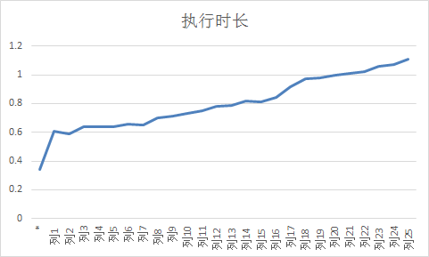

# SQL性能优化案例篇

## 学会辨别虚假信息

在日常生活中，我们经常遇到有人说exits比in快，count(1)执行比count(*)快，但事实是真的这样吗？我们自己去进行过实践吗？

### in与exist之争

 首先创建测试表：

```sql
drop table emp purge;
drop table dept purge;
create table emp as select * from scott.emp;
create table dept as select * from scott.dept;
```

 在Oracle 11g中执行并查看执行计划：

```sql
select * from dept where deptno NOT IN ( select deptno from emp ) ;
select * from dept where not exists ( select deptno from emp where     emp.deptno=dept.deptno) ;
```

```sql
SQL> set autotrace traceonly;
SQL> select * from dept where deptno NOT IN ( select deptno from emp ) ;
```

```sql
SQL> set autotrace traceonly
SQL> select * from dept where deptno NOT IN ( select deptno from emp where deptno is not null) and deptno is not null;
```

我们发现两个语句的效率是一样的，查看执行计划也是一样的。原来oracle在11g中已经做了优化，所以in和exist的效率是一样的。

由此我们可以得出结论，在11g中，使用in和exist的效率是一样的，因为他们走的都是比较高效的ANTI算法。而网上所说的in慢于exist是在10g的时候会出现的情况，因为10g的时候在不指定列为非空的情况下，in走的是filter的算法，现对于anti半连接算法比较低效，但是在10g当中sql语句指定不为空，也可走anti算法。比如：

```sql
select * from dept where deptno NOT IN ( select deptno from emp where deptno is not null) and deptno is not null;
```

### count谁最快

 首先创建测试表：

```sql
drop table test purge;
create table test as select * from dba_objects;
update test set object_id =rownum ;
commit;
```

  在无索引的情况下，比较count(*)与count(object_id)

```sql
--查看执行时间
SQL> set timing on 
SQL> set autotrace traceonly; 
SQL> select count(*) from test;
```

```
SQL> select count(object_id) from test;
```

我们在列object_id上创建索引，再次比较count(*)与count(object_id)

```sql
create index idx_object_id on test(object_id);
```

```sql
SQL> select count(*) from test;
```

```sql
SQL> select count(object_id) from test;
```

发现count(object_id)的速度明显比count(*)高出一大截，难道是因为count(object_id)能用到索引，所以效率才提高了很多？

我们再修改下object_id的列属性，再次比较count(*)与count(object_id)

```sql
SQL> select count(*) from test;
```

```sql
SQL> select count(object_id) from test;
```

结论：

1）对于上述实验来说，在一个无任何索引的表中count(*)与count(object_id)的性能是一样的；

2）在某一列有索引但此列可为空的前提下，count(*)比count(object_id)慢，因为count(object_id)用到了索引；

3）在某一列有索引但此列不为空的前提下count(*)与count(object_id)的性能是一样的；

另在没有索引的情况下，对不同的列做实验发现：



对于oracle优化器来说，count不同的列，统计的时间是不一样的，大致趋势是列越靠后，访问的开销越大，列的偏移量决定访问的性能。而count(*)的开销与偏移量无关。

因此，在某些场合count(*)反而是最快的。

### 表的条件顺序

```sql
drop table t1 purge;
drop table t2 purge;
create table t1 as select * from dba_objects;
create table t2 as select rownum id ,dbms_random.string('b', 50) n ,data_object_id data_id from dba_objects where rownum<=10000;
set autotrace traceonly
set linesize 1000
set timing on
select /*+rule*/ * from t1,t2 where t1.object_id=29 and t2.data_id>8;
select /*+rule*/ * from t1,t2 where t2.data_id>8 and t1.object_id=29 ;


--加个关联条件看看，看看
select /*+rule*/ * from t1,t2 where t1.object_id=t2.id and t1.object_id=29 and t2.data_id>8;
select /*+rule*/ * from t1,t2 where t1.object_id=t2.id and t2.data_id>8 and t1.object_id=29 ;
```

> 结论：通过上述实验发现，无论有过滤条件的WHERE放在后面还是放在前面，效果是一样的。因此，关于有过滤条件的WHERE放在后面的说法是错误的。

### 表的连接顺序

```sql
--来来来，做一个试验，看看SQL写法中，表的连接顺序是否很重要
drop table tab_big;
drop table tab_small;
create table tab_big  as select * from dba_objects;
create table tab_small  as select * from dba_objects where rownum<=100;

set autotrace traceonly
set linesize 1000
set timing on 

select count(*) from tab_big,tab_small   ;  
select count(*) from tab_small,tab_big   ;
---奇怪，以上实验发现性能是一样的，咋回事呢，看来真是谣言啊，这真是恶意传谣吗？

---大家看看下面的语句，比较一下性能。
select /*+rule*/ count(*) from tab_big,tab_small ;  
select /*+rule*/ count(*) from tab_small,tab_big ;
```

> 结论：原来表连接顺序的说法早就过时了，在基于规则的时代，小表在后，大表在前确实性能高于小表在前大表在后，现在oracle是基于代价的。性能是一样的。

## 索引优化的优劣

### 索引的优势

#### 索引优化之回表

```sql
--索引回表读（TABLE ACCESS BY INDEX ROWID）的例子
drop table t purge;
create table t as select * from dba_objects;
--只建一个主键索引，查询所有字段*
create index idx1_object_id on t(object_id);

--试验1
set autotrace traceonly
set linesize 1000
set timing on
select * from t where object_id<=5;
--试验2
--比较消除TABLE ACCESS BY INDEX ROWID回表后的性能，将select * from改为select object_id from 
set autotrace traceonly
set linesize 1000
set timing on
select object_id from t where object_id<=5;

--试验3：通过构造联合索引，再观察一个消除TABLE ACCESS BY INDEX ROWID的例子
create index idx_un_objid_objname on t(object_id,object_name);
set autotrace traceonly
set linesize 1000
set timing on
select object_id,object_name from t where object_id<=5;
```

> 结论：通过观察执行计划，我们发现当不回表的时候，性能更好，因为只在索引当中就查到了我们想要的字段。

#### 索引优化之索引的高度

````sql
create table t1 as select rownum as id ,rownum+1 as id2,rpad('*',1000,'*') as contents from dual connect by level<=2;
create table t2 as select rownum as id ,rownum+1 as id2,rpad('*',1000,'*') as contents from dual connect by level<=20;
create table t3 as select rownum as id ,rownum+1 as id2,rpad('*',1000,'*') as contents from dual connect by level<=200;
create table t4 as select rownum as id ,rownum+1 as id2,rpad('*',1000,'*') as contents from dual connect by level<=2000;
create table t5 as select rownum as id ,rownum+1 as id2,rpad('*',1000,'*') as contents from dual connect by level<=20000;
create table t6 as select rownum as id ,rownum+1 as id2,rpad('*',1000,'*') as contents from dual connect by level<=200000;
create table t7 as select rownum as id ,rownum+1 as id2,rpad('*',1000,'*') as contents from dual connect by level<=2000000;

create index idx_id_t1 on t1(id);
create index idx_id_t2 on t2(id);
create index idx_id_t3 on t3(id);
create index idx_id_t4 on t4(id);
create index idx_id_t5 on t5(id);
create index idx_id_t6 on t6(id);
create index idx_id_t7 on t7(id);
--观察索引的高度的不同
select index_name,--索引名字
          blevel,--索引高度
          leaf_blocks,--索引叶子占用块
          num_rows,--行数
          distinct_keys,
          clustering_factor
     from user_ind_statistics
    where table_name in( 'T1','T2','T3','T4','T5','T6','T7');

--执行    
set autotrace traceonly statistics
set linesize 1000
--注意观察逻辑读的次数，另外每条语句执行2遍以上，观察第2遍的结果。为了消除物理读以及递归调用。
select * from t1 where id=1;
select * from t2 where id=1;
select * from t3 where id=1;
select * from t4 where id=1;
select * from t5 where id=1;
select * from t6 where id=1;
select * from t7 where id=1;
--观察全表扫描的结果
select /*+full(t1)*/ * from t1 where id=1; 
select /*+full(t2)*/ * from t2 where id=1; 
select /*+full(t3)*/ * from t3 where id=1; 
select /*+full(t4)*/ * from t4 where id=1; 
select /*+full(t5)*/ * from t5 where id=1; 
select /*+full(t6)*/ * from t6 where id=1; 
select /*+full(t7)*/ * from t7 where id=1; 
````

> 结论：当索引的高度相同时，使用索引查询，发现产生逻辑读的次数一般相同；而使用全表扫描的差异巨大。但是请注意这是建立在返回一条数据或者少数数据的前体下，如果返回大量的数据，使用索引反而比使用全表扫描更慢。另外，在本案例中，大家也许觉得两百万数据量在全表扫描时执行速度也很快，那是因为这些表字段很少，oracle不会占用很多的数据块，当表的字段同样类型的增加到40个乃至更多，速度自然而然就慢了，因为遍历的块更多了。所以我们有时可以删除一些不需要的字段从而使某些需要全表扫描的场合性能提高。

#### 索引优化之count，sum，avg

```sql
drop table t purge;
create table t as select * from dba_objects;
update t set object_id=rownum;
commit;
create index idx1_object_id on t(object_id);
set autotrace on
--此时走的是全表扫描
select count(*) from t;
--此时走的是索引
select count(*) from t where object_id is not null;
--也可以不加is not null，直接把列的属性设置为not null，也成，继续试验如下：
alter table t modify OBJECT_ID not null;
select count(*) from t;
--如果是主键就无需定义列是否允许为空了。因为主键本身就不能为空，此时也可走索引

--sum以及avg同样的套路，可以自行实验，至少在11g当中是这样
```

> 结论：当我们在使用count函数，或者是sum以及avg聚合函数时，当此列有索引的时候，要注意此列的取值是否可为空，这关系到是否使用索引；当没有索引时，根据实际情况考虑是否添加索引。

#### 索引优化之distinct

```sql
drop table t purge;
create table t as select * from dba_objects;
update t set object_id=rownum;
alter table T modify OBJECT_ID not null;
update t set object_id=2;
update t set object_id=3 where rownum<=25000;
commit;
set linesize 1000
set autotrace traceonly
--测试1
select distinct object_id from t ;
--测试2
create index idx_t_object_id on t(object_id);
select  /*+index(t)*/ distinct object_id from t ;
```

> 结论：经测试发现，执行计划当中并没有显示其发生了排序操作，那是因为在oracle10g的R2环境之后，DISTINCT由于其 HASH UNIQUE的算法导致其不会产生排序，不过虽然没有排序，通过观察执行计划当中的TempSpc可知distinct消耗PGA内存进行HASH UNIQUE运算；接下来看看建了索引后的情况，TempSpc关键字并没有消失，因此网上许多所说的会消失是不正确的，至少在oracle11g（11.2.0.1.0）当中并没有消失，但是COST确实下降许多；不过在现实中，DISTINCT往往靠索引来优化效果并不是很明显，因为大多数用到DISTINCT的地方是因为我们的表中有重复记录，因此，我们一般首先要考虑的是为什么会重复。

#### 索引优化之union

```sql
----UNION 是需要排序的
drop table t1 purge;
create table t1 as select * from dba_objects where object_id is not null;
alter table t1 modify OBJECT_ID not null;
drop table t2 purge;
create table t2 as select * from dba_objects where object_id is not null;
alter table t2 modify OBJECT_ID not null;


set linesize 1000
set autotrace traceonly

select object_id from t1
union
select object_id from t2;

--发现索引无法消除UNION 排序
create index idx_t1_object_id on t1(object_id);
create index idx_t2_object_id on t2(object_id);
set autotrace traceonly
set linesize 1000

select  object_id from t1
union
select  object_id from t2;
```

> 结论：使用UNION是会产生排序的，使用索引无法消除UNION 排序，因此我们在使用的时候要确定是否有使用的 必要，如果表中没有重复记录，则使用UNION ALL即可。

#### 索引优化之order by

```sql
drop table t purge;
create table t as select * from dba_objects ;
set autotrace traceonly
set linesize 1000
--以下语句没有索引又有order by ，必然产生排序
select * from t where object_id>2 order by object_id;
---新增索引后，Oracle就有可能利用索引本身就有序的特点，利用索引来避免排序，如下：
create index idx_t_object_id on t(object_id);
select * from t where object_id>2 order by object_id;
--如下情况Oracle肯定毫不犹豫的选择用索引,因为回表取消了 !      
select  object_id from t where object_id>2 order by object_id;
--如下情况，就算有索引，oracle也不会用索引
select  object_id from t where object_id>2; 
```

### 索引的劣势

#### 位图索引遭遇更新苦不堪言

测试数据准备

```sql
drop table t purge;
create table t 
(name_id,
 gender not null,
 location not null,
 age_group not null,
 data
 )
 as
 select rownum,
        decode(ceil(dbms_random.value(0,2)),
               1,'M',
               2,'F')gender,
        ceil(dbms_random.value(1,50)) location,
        decode(ceil(dbms_random.value(0,3)),
               1,'child',
               2,'young',
               3,'middle_age',
               4,'old'),
         rpad('*',400,'*')
from dual connect by rownum<=100000;

create bitmap index gender_idx on t(gender);
---实验一：
--SESSION 1 不提交
insert into t(name_id,gender,location ,age_group ,data) values (100001,'M',45,'child',rpad('*',20,'*'));
--SESSION 2
insert into t(name_id,gender,location ,age_group ,data) values (100002,'M',46, 'young', rpad('*',20,'*'));
---实验二：
--SESSION 1（持有者）
DELETE FROM T WHERE GENDER='M' AND LOCATION=25;
---SESSION 2(其他会话) 插入带M的记录就立即被阻挡，以下三条语句都会被阻止
insert  into t (name_id,gender,location ,age_group ,data) values (100001,'M',78, 'young','TTT');
update t set gender='M' WHERE LOCATION=25;
delete from T WHERE GENDER='M';
--实验三：
--SESSION 1（持有者）
DELETE FROM T WHERE GENDER='M' AND LOCATION=25;
---SESSION 2(其他会话)
--以下是可以进行不受阻碍的
insert  into t (name_id,gender,location ,age_group ,data) values (100001,'F',78, 'young','TTT');
delete from  t where gender='F' ;
UPDATE T SET LOCATION=100 WHERE ROWID NOT IN ( SELECT ROWID FROM T WHERE GENDER='F' AND LOCATION=25) ; 
```

> 结论：当你对于某一张表的一个字段加了位图索引之后，对于此表的操作，目前可以说几乎只能是单进程单用户操作了，这样的操作显然不支持高并发，对于整体系统并没有好处。因此要注意位图索引的使用场景。

#### 建索引过程会产生全表锁

```sql
drop table t purge;
create table t as select * from dba_objects;
--尽可能插入多点数据，不然操作太快来不及发现
insert into t  select * from t;
insert into t  select * from t;
insert into t  select * from t;
insert into t  select * from t;
insert into t  select * from t;
insert into t  select * from t;
insert into t  select * from t;
commit;

--SESSION 1
create index idx_object_id on t(object_id);
--SESSION 2
update t set object_id=99999 where object_id=8;
delete from t where object_id=8;
insert into  t (OWNER) values ('111');
```

> 结论：经上述实验可得，普通的对表建索引将会导致针对该表的更新操作无法进行，需要等待索引建完。更新操作将会被建索引动作阻塞。SESSION2 的三个操作，均需要SESSION1的索引建完之后才能执行。因此，在我们平时建索引的时候，尤其是对于一些大表在生产系统建立索引的时候一定要在夜里业务不繁忙的时候进行。

#### 索引过多影响插入

```sql
create table test1 as select * from dba_objects;
create table test2 as select * from dba_objects;
create table test3 as select * from dba_objects;
create index idx_owner on test1(owner);
create index idx_object_name on test1(object_name);
create index idx_data_obj_id on test1(data_object_id);
create index idx_created on test1(created);
create index idx_last_ddl_time on test1(last_ddl_time);
create index idx_status on test1(status);
create index idx_t2_sta on test2(status);
create index idx_t2_objid on test2(object_id);
set timing on 
--语句1(test1表有6个索引）
insert into test1 select * from dba_objects;
commit;
--语句2(test2表有2个索引）
insert into test2 select * from dba_objects;
commit;
--语句3(test3表有无索引）
insert into test3 select * from dba_objects;
commit;
```

> 结论：索引越多，插入速度越慢。因为有了索引，更新了记录就更新了索引，就要维护索引那种有序排列的结构，开销比较大。因此我们在项目中建索引要考虑全面，并且建索引要规范。而我们在项目中若遇到大批量的向大表中插入数据时，我们可以先禁用索引，插入完成之后再重建索引，这样效率会比有索引插入快。因为此时重建索引是一个批量的动作，而不是单次插入单次维护索引。

## 表连接优化

#### NL连接（Nest Loop）

```sql
DROP TABLE t1 CASCADE CONSTRAINTS PURGE; 
DROP TABLE t2 CASCADE CONSTRAINTS PURGE; 
CREATE TABLE t1 (
     id NUMBER NOT NULL,
     n NUMBER,
     contents VARCHAR2(4000)); 
CREATE TABLE t2 (
     id NUMBER NOT NULL,
     t1_id NUMBER NOT NULL,
     n NUMBER,
     contents VARCHAR2(4000)); 

INSERT INTO t1 SELECT rownum,rownum, dbms_random.string('a', 50) FROM dual  CONNECT BY level <= 10000 ORDER BY dbms_random.random; 
INSERT INTO t2 SELECT rownum, rownum, rownum, dbms_random.string('b', 50) FROM dual CONNECT BY level <= 1000000 ORDER BY dbms_random.random; 
COMMIT; 

SELECT /*+ leading(t1) use_nl(t2) */ * FROM t1,t2 WHERE t1.id = t2.t1_id AND t1.n= 19

set linesize 1000
--收集统计信息.
alter session set statistics_level=all ;

---1.对t1表的限制条件建索引
CREATE INDEX t1_n ON t1 (n);
SELECT /*+ leading(t1) use_nl(t2) */ * FROM t1,t2 WHERE t1.id = t2.t1_id AND t1.n= 19
--查看执行计划
select * from table(dbms_xplan.display_cursor(null,null,'allstats last'));

---2.在1的基础上对被驱动表t2表的连接条件建索引
CREATE INDEX t2_t1_id ON t2(t1_id);
SELECT /*+ leading(t1) use_nl(t2) */ * FROM t1,t2 WHERE t1.id = t2.t1_id AND t1.n= 19
select * from table(dbms_xplan.display_cursor(null,null,'allstats last'));

---3.确保小结果集先驱动
--我们构造如下：假如oracle的统计信息不准确
--以下故意错乱颠倒，欺骗Oracle说T1表是大表而T2表是小表。
EXEC  dbms_stats.SET_table_stats(user, 'T1', numrows => 20000000  ,numblks => 1000000);
EXEC  dbms_stats.SET_table_stats(user, 'T2', numrows => 1  ,numblks => 1);
--此时t2表为驱动表，t1表为被驱动表，此时发现性能大幅度下降
SELECT * FROM t1, t2 WHERE t1.id  t2.t1_id AND t1.n <= 19;
select * from table(dbms_xplan.display_cursor(null,null,'allstats last'));
```

> 结论：通过以上实验的执行计划可以看出，当使用NL连接的时候，我们保证以上三点，会使sql达到比较好的性能。
>
> 为什么在嵌套循环的驱动表的限制条件建索引,被驱动表的连接条件建索引？
> 驱动表的限制条件建索引的目的是为了减少扫描驱动表的时间。如果在驱动表的连接条件建索引就没有任何意义，所有列关联到另一表的所有列，等同于每条记录都要进行关联，而在驱动表的限制条件建了索引之后，只快速返回一条或者几条记录，然后在传递给被驱动表的连接条件列，一般情况下被驱动表对应的驱动表的记录返回的不多，所以在被驱动表的连接条件建立索引是有必要的。

#### HASH JOIN连接

```sql
--环境构造
DROP TABLE t1 CASCADE CONSTRAINTS PURGE; 
DROP TABLE t2 CASCADE CONSTRAINTS PURGE; 
CREATE TABLE t1 (
     id NUMBER NOT NULL,
     n NUMBER,
     contents VARCHAR2(4000)
   ); 
CREATE TABLE t2 (
     id NUMBER NOT NULL,
     t1_id NUMBER NOT NULL,
     n NUMBER,
     contents VARCHAR2(4000)
   );  
INSERT INTO t1 SELECT  rownum,  rownum, dbms_random.string('a', 50) FROM dual 
CONNECT BY level <= 10000
      ORDER BY dbms_random.random; 
INSERT INTO t2 SELECT rownum, rownum, rownum, dbms_random.string('b', 50) FROM dual CONNECT BY level <= 100000
    ORDER BY dbms_random.random; 
COMMIT; 

--1.两表的限制条件有索引(注：针对索引条件返回记录很少的情况）！
--首先测试Hash Join两表的限制条件皆无索引的情况
alter session set statistics_level=all ;
set linesize 1000
SELECT /*+ leading(t2) use_hash(t1)*/ * FROM t1, t2 WHERE t1.id = t2.t1_id and t1.n=19 and t2.n=12;
select * from table(dbms_xplan.display_cursor(null,null,'allstats last'));
--在t1表的限制条件建索引
create index idx_t1_n on t1(n);
SELECT /*+ leading(t2) use_hash(t1)*/ * FROM t1, t2 WHERE t1.id = t2.t1_id and t1.n=19 and t2.n=12;
select * from table(dbms_xplan.display_cursor(null,null,'allstats last'));
--在t2表的限制条件建索引
create index idx_t2_n on t2(n);   
SELECT /*+ leading(t2) use_hash(t1)*/ * FROM t1, t2 WHERE t1.id = t2.t1_id and t1.n=19 and t2.n=12;
select * from table(dbms_xplan.display_cursor(null,null,'allstats last'));
--2.确保小结果集先驱动
--t1为驱动表
SELECT  * FROM t1, t2 WHERE t1.id = t2.t1_id;
select * from table(dbms_xplan.display_cursor(null,null,'allstats last'));
--t2为驱动表
SELECT  /*+ leading(t2) use_hash(t1)*/ * FROM t1, t2 WHERE t1.id = t2.t1_id;
select * from table(dbms_xplan.display_cursor(null,null,'allstats last'));
--结论：在2的实验中发现，虽然buffers的变化可能很小甚至一样，但是userd-mem却差异比较明显。说明排序尺寸差异明显。在结合时间发现，两者的时间差异也比较明显。大表为驱动表所耗时间较长。

--3.确保PGA尺寸足够
--因为HASH JOIN连接会使用到PGA内存区域的hash area，若内存不够，会用到磁盘的空间。
```

#### Merge Sort Join连接

```sql
--环境构造同上hash join
--1.两表的限制条件有索引
--两表限制条件皆无索引的情况
alter session set statistics_level=all ;
set linesize 1000
SELECT /*+ leading(t2) use_merge(t1)*/ * FROM t1, t2 WHERE t1.id = t2.t1_id and t1.n=19 and t2.n=12;
select * from table(dbms_xplan.display_cursor(null,null,'allstats last'));
--t1表的限制条件建索引
create index idx_t1_n on t1(n);
SELECT /*+ leading(t2) use_merge(t1)*/ * FROM t1, t2 WHERE t1.id = t2.t1_id and t1.n=19 and t2.n=12;
select * from table(dbms_xplan.display_cursor(null,null,'allstats last'));
--t2表的限制条件建索引
create index idx_t2_n on t2(n);
SELECT /*+ leading(t2) use_merge(t1)*/ * FROM t1, t2 WHERE t1.id = t2.t1_id and t1.n=19 and t2.n=12;
select * from table(dbms_xplan.display_cursor(null,null,'allstats last'));
--2.连接字段有索引，争取利用索引来消除排序（可惜的是，在11g以及之前版本，ORACLE算法的限制，只能避免一次排序，后续版本未知，需要试验）
--两表的连接条件都无索引的情况，有两次排序：
set linesize 1000
set autotrace traceonly
SELECT /*+ leading(t1) use_merge(t2)*/ * FROM t1, t2 WHERE t1.id = t2.t1_id;
--t1表建索引，发现排序消除了一个
CREATE INDEX idx_t1_id ON t1(id); 
SELECT /*+ leading(t1) use_merge(t2)*/ * FROM t1, t2 WHERE t1.id = t2.t1_id;
--在t2表的连接条件建索引，发现排序依然有一个，无法消除
CREATE INDEX idx_t2_t1_id ON t2(t1_id);   
SELECT /*+ leading(t1) use_merge(t2)*/ * FROM t1, t2 WHERE t1.id = t2.t1_id;
--3.避免多余列致排序尺寸过大（取部分字段）
--对于NL以及hash连接来说，只取部分列性能基本不会有什么变化
--4.确保PGA尺寸足够
```
