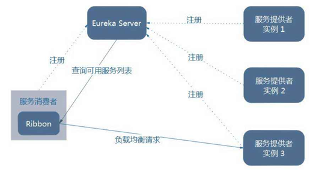
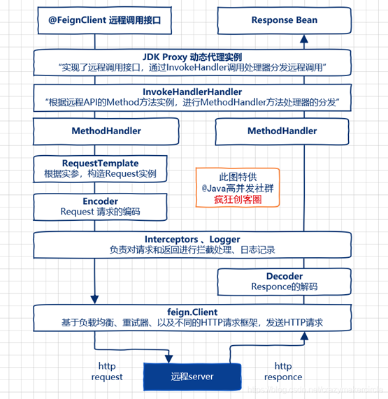
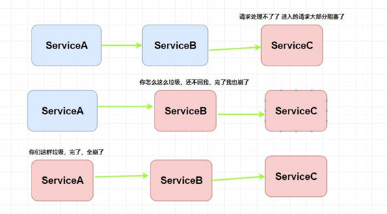
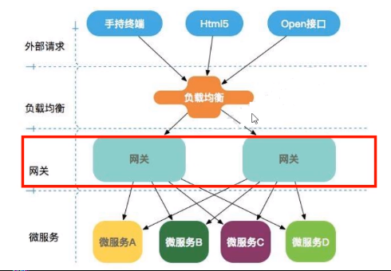
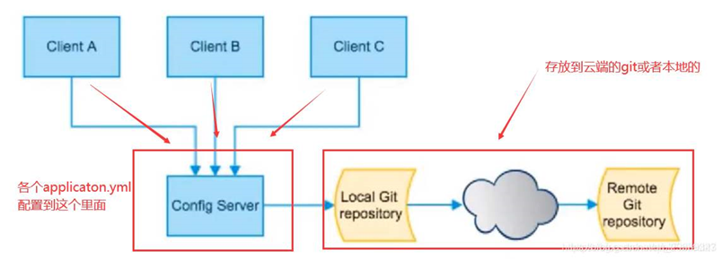
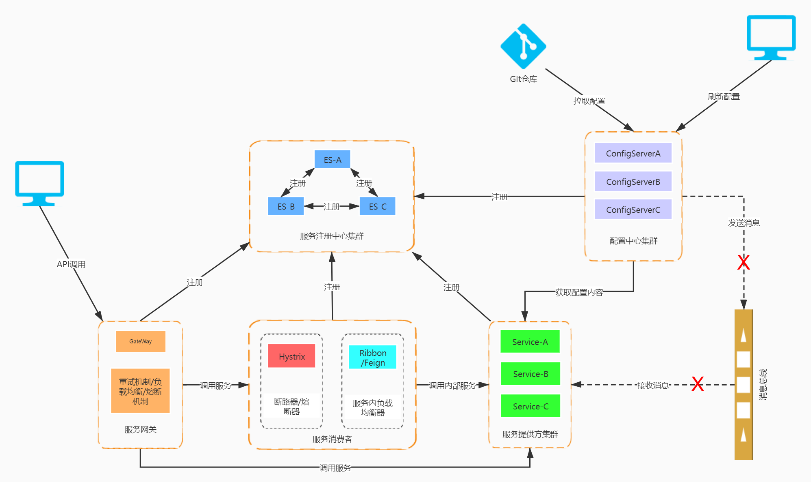

# SpringCloud教程

## Spring Cloud是什么？

Spring Cloud是一系列框架的有序集合。

它利用Spring Boot的开发便利性巧妙地简化了分布式系统基础设施的开发，如服务发现注册、配置中心、消息总线、负载均衡、断路器、数据监控等，都可以用Spring Boot的开发风格做到一键启动和部署。Spring并没有重复制造轮子，它只是将目前各家公司开发的比较成熟、经得起实际考验的服务框架组合起来，通过Spring Boot风格进行再封装屏蔽掉了复杂的配置和实现原理，最终给开发者留出了一套简单易懂、易部署和易维护的分布式系统开发工具包。

微服务是可以独立部署、水平扩展、独立访问（或者有独立的数据库）的服务单元，springcloud就是这些微服务的大管家，采用了微服务这种架构之后，项目的数量会非常多，springcloud做为大管家需要管理好这些微服务，自然需要很多小弟来帮忙。

## 微服务的整体技术栈

| **微服务内容**   | **技术要点**                  |
| ---------------- | ----------------------------- |
| 服务开发         | Spring、SpringMVC、SpringBoot |
| 服务注册与发现   | Eureka、Zookeeper             |
| 服务调用         | Feign、Doubbo                 |
| 负载均衡         | Ribbon、Nginx等               |
| 服务降级熔断     | Hystrix                       |
| 服务配置中心管理 | SpringCloudConfig             |
| 消息队列         | RocketMQ                      |
| 缓存             | Redis                         |

Spring Cloud Netflix

这可是个大boss，地位仅次于老大，老大各项服务依赖与它，与各种Netflix OSS组件集成，组成微服务的核心，它的小弟主要有Eureka, Hystrix, Zuul, Archaius… 太多了

### **Netflix Eureka**

服务中心，云端服务发现，一个基于 REST 的服务，用于定位服务，以实现云端中间层服务发现和故障转移。这个可是springcloud最牛鼻的小弟，服务中心，任何小弟需要其它小弟支持什么都需要从这里来拿，同样的你有什么独门武功的都赶紧过报道，方便以后其它小弟来调用；它的好处是你不需要直接找各种什么小弟支持，只需要到服务中心来领取，也不需要知道提供支持的其它小弟在哪里，还是几个小弟来支持的，反正拿来用就行，服务中心来保证稳定性和质量。

  在微服务架构下，一个应用被拆解为若干个微服务，组成一个分布式应用，各种服务间互相调用。另一方面，出于性能或可用性的考虑，一个微服务常常会部署多份，组成一个集群。如何自动确定系统中有哪些服务、一个服务有哪些实例、这些服务的地址等信息等是个问题，服务注册与发现组件用于解决该问题。
解决了我们不去硬编码服务的地址。

Eureka包含两个组件Eureka Server、Eureka Client

>服务调用关系:
>
>1.服务提供者在启动时，向注册中心注册自己提供的服务。
> 2.服务消费者在启动时，向注册中心订阅自己所需的服务。
> 3.注册中心返回服务提供者地址给消费者。
> 4.服务消费者从提供者地址中调用消费者。
>5.服务续约：发送心跳包，每30秒发送一次。告诉Eureka自己还活着。
>6.如果 Eureka Server 在90秒没有收到 Eureka 客户的续约，它会将实例从其注册表中删除。

### **Netflix Ribbon**

Ribbon它基于Netflix Ribbon实现通过Spring Cloud的封装，可以让我们轻松地将面向服务的REST模版请求自动转换成客户端负载均衡的服务调用，简单的说，Ribbon是一个客户端负载均衡器。
     负载均衡在系统架构中是一个非常重要，因为负载均衡是对系统的高可用、缓解系统网络压力的重要手段之一。我们通常所说的负载均衡都指的是服务端负载均衡，包括硬件负载F5、软件负载Nginx等。
Ribbon工作时分为两步：

1. 选择Eureka Server，它优先选择在同一个Zone且负载较少的Server；

2. 再根据用户指定的策略，再从Server取到的服务注册列表中选择一个地址。其中Ribbon提供了很多策略，例如轮询round robin、随机Random、根据响应时间加权等。

   

### **Netflix Feign**

Feign是一个声明式的Web服务客户端，让编写Web服务客户端变得非常容易，使用Feign只需要创建一个接口加上对应的注解，开发微服务，免不了需要服务间调用。在Spring Cloud中使用Feign，可以做到使用HTTP请求访问远程服务，就像调用本地方法一样的，开发者完全感知不到这是在调用远程方法，更感知不到在访问HTTP请求。

Feign远程调用，核心就是通过一系列的封装和处理，将以JAVA注解的方式定义的远程调用API接口，最终转换成HTTP的请求形式，然后将HTTP的请求的响应结果，解码成JAVA Bean，放回给调用者。Feign远程调用的基本流程，大致如下图

### **Netflix Hystrix**

熔断器，容错管理工具，旨在通过熔断机制控制服务和第三方库的节点,从而对延迟和故障提供更强大的容错能力。比如突然某个小弟生病了，但是你还需要它的支持，然后调用之后它半天没有响应，你却不知道，一直在等等这个响应；有可能别的小弟也正在调用你的武功绝技，那么当请求多之后，就会发生严重的阻塞影响老大的整体计划。这个时候Hystrix就派上用场了，当Hystrix发现某个小弟不在状态不稳定立马马上让它下线，让其它小弟来顶上来，或者给你说不用等了这个小弟今天肯定不行，该干嘛赶紧干嘛去别在这排队了。

**服务雪崩**

服务雪崩效应是一种因**服务提供者**的不可用导致**服务调用者**的不可用,并将不可用逐渐放大的过程。
一个服务失败，导致整条链路的服务都失败的情形，我们称之为服务雪崩。如下图所示
服务熔断和服务降级就可以视为解决服务雪崩的手段之一，Hystrix是一个库，可通过添加等待时间容限和容错逻辑来控制这些分布式服务之间的交互,提高系统的高可用。

**Hystrix设计原则**

- 防止单个依赖耗尽容器（例如 Tomcat）内所有用户线程
- 降低系统负载，对无法及时处理的请求快速失败（fail fast）而不是排队
- 提供失败回退，以在必要时让失效对用户透明化
- 使用隔离机制（例如『舱壁』/『泳道』模式，熔断器模式等）降低依赖服务对整个系统的影响
- 针对系统服务的度量、监控和报警，提供优化以满足近似实时性的要求
- 在 Hystrix 绝大部分需要动态调整配置并快速部署到所有应用方面，提供优化以满足快速恢复的要求
- 能保护应用不受依赖服务的整个执行过程中失败的影响，而不仅仅是网络请求

**服务熔断**

当下游的服务因为某种原因突然变得不可用或响应过慢，上游服务为了保证自己整体服务的可用性，不再继续调用目标服务，直接返回，快速释放资源。如果目标服务情况好转则恢复调用。
 	比如每当20个请求中，有50%失败时，熔断器就会打开，此时再调用此服务，将会直接返回失败，不再调远程服务。直到5s钟之后，重新检测该触发条件，判断是否把熔断器关闭，或者继续打开。
**总结: 避免发送大量无效请求影响系统吞吐量, 并且断路器有自我检测并恢复的能力。**

**服务降级**

当下游的服务因为某种原因响应过慢或服务因为某种原因不可用，上游主动调用本地的一些降级逻辑，避免卡顿，迅速返回。
常见的降级有超时处理、线程池隔离（可以进行限流，并控制自己方法的线程池）
其中Feign也内置了Hystrix。可以在调用时发现服务宕机，使用自己的处理类进行返回。
总的来说降级是保护系统的一种手段.而熔断是自我恢复的*。*降级是主动的，熔断是被动的。

### Spring Cloud  GateWay

微服务面临的问题：
不同的微服务一般会有不同的网络地址，而外部客户端可能需要调用多个服务的接口才能完成一个业务需求。
如果让客户端直接与各个微服务通信，会有以下的问题： 
1.客户端会多次请求不同的微服务，增加了客户端的复杂性。 
2.存在跨域请求，在一定场景下处理相对复杂。 
3.认证复杂，每个服务都需要独立认证。
Gateway 作为 Spring Cloud 生态系统中的网关,不仅提供统一的路由方式，并且基于 Filter 链的方式提供了网关基本的功能，例如：安全认证、监控/日志记录、和限流等。

**GateWay核心功能**：

- Route（路由）：网关配置的基本组成模块，一个Route模块由一个 ID，一个目标 URI，一组断言和一组过滤器定义。如果断言为真，则路由匹配，目标URI会被访问

- Predicate（断言）：路由转发的判断条件，目前SpringCloud Gateway支持多种方式.

  常见如：Path、Query、Method、Header等。

- Filter（过滤器）：过滤器是路由转发请求时所经过的过滤逻辑，可用于修改请求、响应内容。

  

### Spring Cloud Config

俗称的配置中心，配置管理工具包，让你可以把配置放到远程服务器，集中化管理集群配置，目前支持本地存储、Git以及Subversion。就是以后大家武器、枪火什么的东西都集中放到一起，别随便自己带，方便以后统一管理、升级装备。

Spring Cloud Config项目是一个解决分布式系统的配置管理方案。它包含了Client和Server两个部分，server提供配置文件的存储、以接口的形式将配置文件的内容提供出去，client通过接口获取数据、并依据此数据初始化自己的应用。

## 和Spring Boot 是什么关系

Spring Boot 是 Spring 的一套快速配置脚手架，可以基于Spring Boot 快速开发单个微服务，Spring Cloud是一个基于Spring Boot实现的云应用开发工具；Spring Boot专注于快速、方便集成的单个个体，Spring Cloud是关注全局的服务治理框架；Spring Boot使用了默认大于配置的理念，很多集成方案已经帮你选择好了，能不配置就不配置，Spring Cloud很大的一部分是基于Spring Boot来实现,可以不基于Spring Boot吗？不可以。

Spring Boot可以离开Spring Cloud独立使用开发项目，但是Spring Cloud离不开Spring Boot，属于依赖的关系。

> spring -> spring boot > Spring Cloud 这样的关系。

## Spring Cloud的优势

微服务的框架那么多比如：dubbo、Kubernetes，为什么就要使用Spring Cloud的呢？

- 产出于spring大家族，spring在企业级开发框架中无人能敌，来头很大，可以保证后续的更新、完善。比如dubbo现在就差不多死了
- 有Spring Boot 这个独立干将可以省很多事，大大小小的活Spring Boot都搞的挺不错。
- 作为一个微服务治理的大家伙，考虑的很全面，几乎服务治理的方方面面都考虑到了，方便开发开箱即用。
- Spring Cloud 活跃度很高，教程很丰富，遇到问题很容易找到解决方案
- 轻轻松松几行代码就完成了熔断、均衡负载、服务中心的各种平台功能

Spring Cloud对于中小型互联网公司来说是一种福音，因为这类公司往往没有实力或者没有足够的资金投入去开发自己的分布式系统基础设施，使用Spring Cloud一站式解决方案能在从容应对业务发展的同时大大减少开发成本。同时，随着近几年微服务架构和Docker容器概念的火爆，也会让Spring Cloud在未来越来越“云”化的软件开发风格中立有一席之地，尤其是在目前五花八门的分布式解决方案中提供了标准化的、全站式的技术方案，意义可能会堪比当前Servlet规范的诞生，有效推进服务端软件系统技术水平的进步。

## 微服务的架构图

## 推荐阅读

[SpringCloud中文教程社区](http://springcloud.fun/)

[SpringCloud中文文档](https://www.springcloud.cc/)