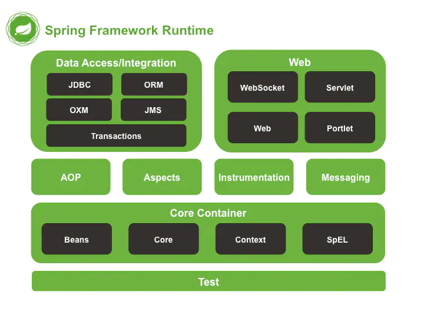

# Spring入门教程

## Spring概述

Spring 框架是 Java 应用最广的框架，它的**成功来源于理念，而不是技术本身**，它的理念包括 **IoC (Inversion of Control，控制反转)** 和 **AOP(Aspect Oriented Programming，面向切面编程)**。

1. Spring 是一个**轻量级的 DI / IoC 和 AOP 容器的开源框架**，来源于 Rod Johnson 在其著作**《Expert one on one J2EE design and development》**中阐述的部分理念和原型衍生而来。
2. Spring 提倡以**“最少侵入”**的方式来管理应用中的代码，这意味着我们可以随时安装或者卸载 Spring

- **适用范围：任何 Java 应用**
- **Spring 的根本使命：简化 Java 开发**

3. **Spring 的优良特性**

- 非侵入式：基于Spring开发的应用中的对象可以不依赖于Spring的API

- 控制反转：IOC——Inversion of Control，指的是将对象的创建权交给 Spring 去创建。使用 Spring 之前，对象的创建都是由我们自己在代码中new创建。而使用 Spring 之后。对象的创建都是由给了 Spring 框架。

- 依赖注入：DI——Dependency Injection，是指依赖的对象不需要手动调用 setXX 方法去设置，而是通过配置赋值。

- 面向切面编程：Aspect Oriented Programming——AOP

- 容器：Spring 是一个容器，因为它包含并且管理应用对象的生命周期

- 组件化：Spring 实现了使用简单的组件配置组合成一个复杂的应用。在 Spring 中可以使用XML和Java注解组合这些对象。

- 一站式：在 IOC 和 AOP 的基础上可以整合各种企业应用的开源框架和优秀的第三方类库（实际上 Spring 自身也提供了表述层的 SpringMVC 和持久层的 Spring JDBC）。

## Spring 能帮我们做什么

1. Spring能帮我们根据配置文件**创建及组装对象之间的依赖关系**。
2. Spring 面向切面编程**能帮助我们**无耦合的实现日志记录，性能统计，安全控制。
3. Spring**提供了与第三方数据访问框架（如Hibernate、JPA）无缝集成**，而且自己也提供了一套**JDBC访问模板**来方便数据库访问
4. Spring还提供与**第三方Web（如Struts1/2、JSF）框架无缝集成**，而且自己也提供了一套**Spring MVC**框架，来方便web层搭建
5. Spring 能**方便的与Java EE（如Java Mail、任务调度）整合**，与**更多技术整合（比如缓存框架）**

​    总之Spring能够集成各种优秀的框架降低开发难度，Spring 框架是一个Java平台，它为开发Java应用程序提供全面的基础架构支持。Spring负责基础架构，让我们可以专注于应用程序的开发。

## Spring体系结构

Spring 有可能成为所有企业应用程序的一站式服务点，Spring 是模块化的，允许你挑选和选择适用于你的模块，不必要把剩余部分也引入。下面的部分对在 Spring 框架中所有可用的模块给出了详细的介绍。

1. **Data Access/Integration（数据访问／集成）**

   数据访问/集成层包括 JDBC、ORM、OXM、JMS 和 Transactions 模块，具体介绍如下。

> - JDBC 模块：提供了一个 JDBC 的抽象层，大幅度减少了在开发过程中对数据库操作的编码。
> - ORM 模块：对流行的对象关系映射 API，包括 JPA、JDO、Hibernate和 iBatis 提供了的集成层。
> - OXM 模块：提供了一个支持对象/XML 映射的抽象层实现，如 JAXB、Castor、XMLBeans、JiBX 和 XStream。
> - JMS 模块：指 Java 消息服务，包含的功能为生产和消费的信息。
> - Transactions 事务模块：支持编程和声明式事务管理实现特殊接口类，并为所有的 POJO。

2. **Web 模块**

   Spring 的 Web 层包括 Web、Servlet、Struts 和 Portlet 组件，具体介绍如下。

> - Web 模块：提供了基本的 Web 开发集成特性，例如多文件上传功能、使用的 Servlet 监听器的 IoC 容器初始化以及 Web 应用上下文。
> - Servlet模块：包括 Spring 模型—视图—控制器（MVC）实现 Web 应用程序。
> - Struts 模块：包含支持类内的 Spring 应用程序，集成了经典的 Struts Web 层。
> - Portlet 模块：提供了在 Portlet 环境中使用 MV C实现，类似 Web-Servlet 模块的功能。

3. **Core Container（核心容器）**

   Spring 的核心容器是其他模块建立的基础，由 Beans 模块、Core 核心模块、Context 上下文模块和 Expression Language 表达式语言模块组成，具体介绍如下。

> - Beans 模块：提供了 BeanFactory，是工厂模式的经典实现，Spring 将管理对象称为 Bean。
> - Core 核心模块：提供了 Spring 框架的基本组成部分，包括 IoC 和 DI 功能。
> - Context 上下文模块：建立在核心和 Beans 模块的基础之上，它是访问定义和配置任何对象的媒介。ApplicationContext 接口是上下文模块的焦点。
> - Expression Language 模块：是运行时查询和操作对象图的强大的表达式语言。

4. **其他模块**

   Spring的其他模块还有 AOP、Aspects、Instrumentation 以及 Test 模块，具体介绍如下。

> - AOP 模块：提供了面向切面编程实现，允许定义方法拦截器和切入点，将代码按照功能进行分离，以降低耦合性。
> - Aspects 模块：提供与 AspectJ 的集成，是一个功能强大且成熟的面向切面编程（AOP）框架。
> - Instrumentation 模块：提供了类工具的支持和类加载器的实现，可以在特定的应用服务器中使用。
> - Test 模块：支持 Spring 组件，使用 JUnit 或 TestNG 框架的测试。

## Spring IOC

**IoC：Inverse of Control（控制反转）**

IoC 是指在程序开发中，实例的创建不再由调用者管理，而是由 Spring 容器创建。Spring 容器会负责控制程序之间的关系，而不是由程序代码直接控制，因此，控制权由程序代码转移到了 Spring 容器中，控制权发生了反转，这就是 Spring 的 IoC 思想。

- 读作 **“反转控制”**，更好理解，不是什么技术，而是一种**设计思想**，就是**将原本在程序中手动创建对象的控制权，交由Spring框架来管理。**
- **正控：**若要使用某个对象，需要**自己去负责对象的创建**
- **反控：**若要使用某个对象，只需要**从 Spring 容器中获取需要使用的对象，不关心对象的创建过程**，也就是把**创建对象的控制权反转给了Spring框架**

**DI：Dependency Injection（依赖注入）**

指 Spring 创建对象的过程中，**将对象依赖属性（简单值，集合，对象）通过配置设值给该对象**

总结：IOC的思想最核心的地方在于，资源不由使用资源的双方管理，而由不使用资源的第三方管理，这可以带来很多好处。第一，资源集中管理，实现资源的可配置和易管理。第二，降低了使用资源双方的依赖程度，也就是我们说的耦合度。

## Spring AOP 

面向切面编程（AOP）和面向对象编程（OOP）类似，也是一种编程模式。Spring AOP 是基于 AOP 编程模式的一个框架，它的使用有效减少了系统间的重复代码，达到了模块间的松耦合目的。

AOP 要实现的是在我们原来写的代码的基础上，进行一定的包装，如在方法执行前、方法返回后、方法抛出异常后等地方进行一定的拦截处理或者叫增强处理。

AOP 的实现并不是因为 Java 提供了什么神奇的钩子，可以把方法的几个生命周期告诉我们，而是我们要实现一个代理，实际运行的实例其实是生成的代理类的实例。

为了更好地理解 AOP，就需要对 AOP 的相关术语有一些了解，这些专业术语主要包含 Joinpoint、Pointcut、Advice、Target、Weaving、Proxy 和 Aspect，它们的含义如下表所示。

| 名称                | 说明                                                         |
| ------------------- | ------------------------------------------------------------ |
| Joinpoint（连接点） | 类里面的那些方法可以被增强，这些方法称为连接点。             |
| Pointcut（切入点）  | 实际被真正增强的方法，称为切入点                             |
| Advice（通知）      | 实际增强的逻辑部分称为通知。通知类型有很：前置、后置、环绕、异常等 |
| Aspect（切面）      | 把通知应用到切入点。                                         |

## 系统学习教程

-  [Spring W3Cschool教程 ](https://www.w3cschool.cn/wkspring/f6pk1ic8.html)
-  [极客学院Spring Wiki](http://wiki.jikexueyuan.com/project/spring/transaction-management.html)