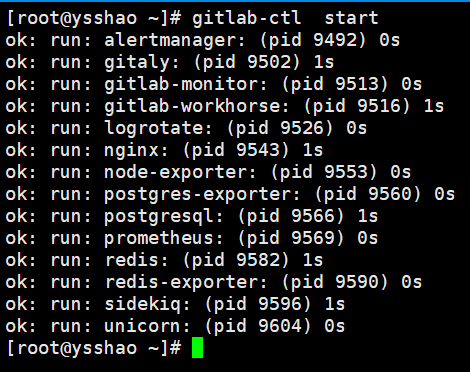
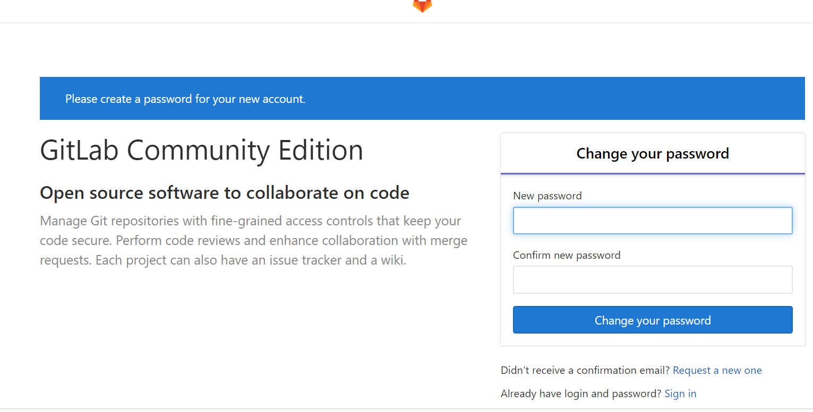
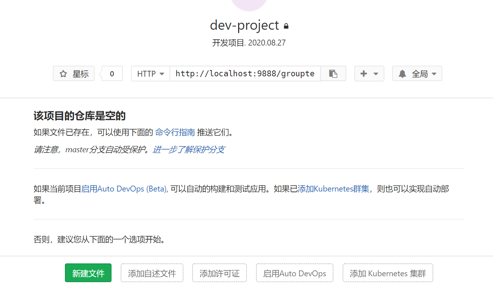
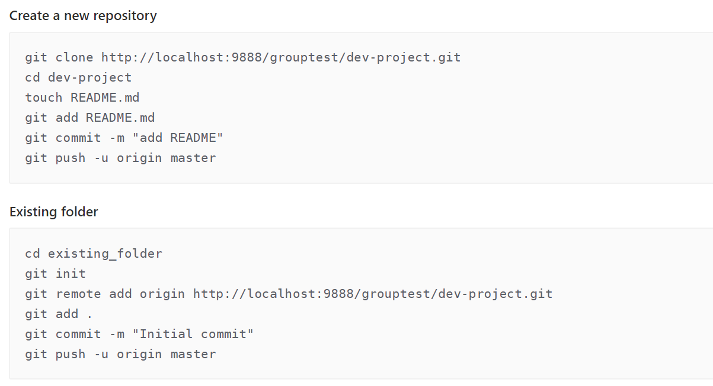
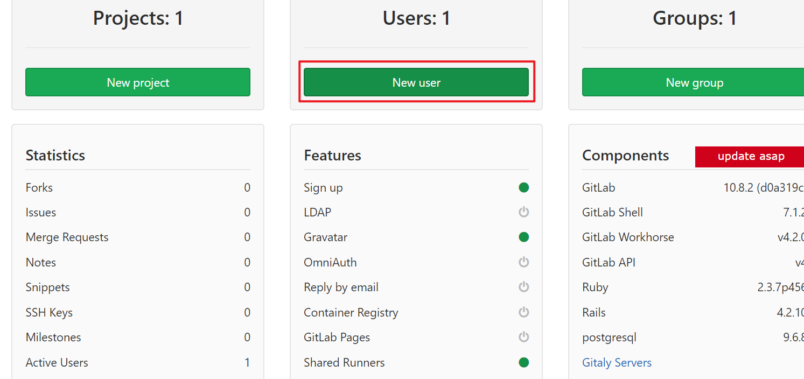
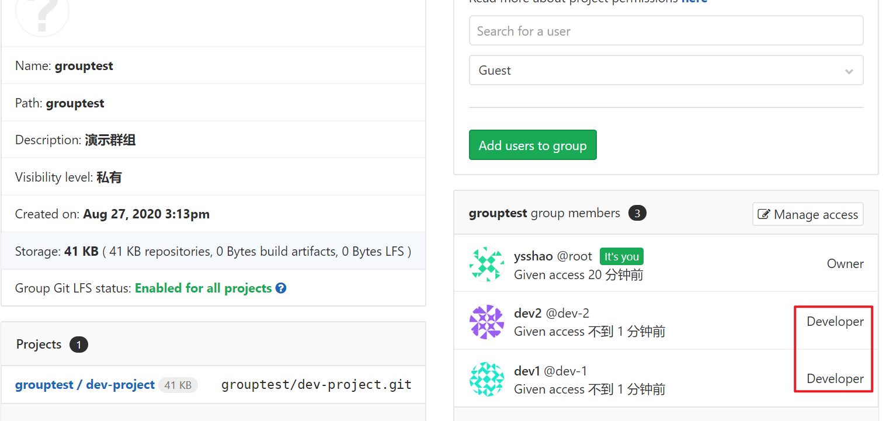

# GitLab仓库的搭建及使用

## GitLab简介

GitLab 是一个用于仓库管理系统的开源项目。使用Git作为代码管理工具，并在此基础上搭建起来的web服务，它集成了Github的可视化功能，方便开发人员协同工作。

 GitLab拥有与Github类似的功能，能够浏览源代码，管理缺陷和注释。可以管理团队对仓库的访问，它非常易于浏览提交过的版本并提供一个文件历史库。它还提供一个代码片段收集功能可以轻松实现代码复用，便于日后有需要的时候进行查找。

## GitLab仓库的搭建与使用

### 安装并配置必要的依赖关系

```shell
1.安装ssh
sudo yum install -y curl policycoreutils-pythonopenssh-server
2.将SSH服务设置成开机自启动，安装命令
sudo systemctl enable sshd  
3.启动SSH服务，安装命令
sudo systemctl start sshd
4.安装防火墙（如果已经安装了防火墙并且已经在运行状态，则可直接进行第6步）
yum install firewalld systemd -y
5.开启防火墙，安装命令
service firewalld  start
6.添加http服务到firewalld,pemmanent表示永久生效，若不加--permanent系统下次启动后就会失效。
sudo firewall-cmd --permanent --add-service=http
7.重启防火墙
sudo systemctl reload firewalld
8.接下来，安装Postfix以发送通知邮件
sudo yum install postfix
9.将postfix服务设置成开机自启动
sudo systemctl enable postfix
10.启动postfix
sudo systemctl start postfix
```

### 添加GitLab镜像源并安装gitlab服务器

添加GitLab镜像源并安装gitlab服务器

```shell
#可手工下载上传
wget https://mirrors.tuna.tsinghua.edu.cn/gitlab-ce/yum/el7/gitlab-ce-10.0.0-ce.0.el7.x86_64.rpm
```

安装gitlab 安装命令`rpm -i gitlab-ce-10.0.0-ce.0.el7.x86_64.rpm`

修改gitlab配置文件指定服务器ip和自定义端口

```shell
vi  /etc/gitlab/gitlab.rb
在底部添加
external_url 'http://localhost:9888'
```

重置并启动GitLab服务器（root权限）

gitlab-ctl  reconfigure

gitlab-ctl  restart

命令：**`gitlab-ctl stop`|start|restart|status**

注意：每次修改配置文件都需要重置

启动GitLab服务器`gitlab-ctl start`

 

浏览器输入前面配置好的地址访问：http://192.168.58.132:9888/

登陆控制能正常访问，说明已经安装成功。

### GitLab搭建私仓过程

登陆控制台，输入root、初始密码`5iveL!Fe`。登陆时会提示修改密码。



创建群组，群组是为了更好的管理和规划项目。

创建创建群组项目，让属于这个群组的可以查看。



​    初始化项目，新建项目或已存在的项目提交。



​	创建账户



 群组指导对应的用户，并分配权限

> Gitlab用户在组中有五种权限：Guest、Reporter、Developer、Master、Owner
>
> Guest：可以创建issue、发表评论，不能读写版本库
> Reporter：可以克隆代码，不能提交，QA、PM可以赋予这个权限
> Developer：可以克隆代码、开发、提交、push，RD可以赋予这个权限
> Master：可以创建项目、添加tag、保护分支、添加项目成员、编辑项目，核心RD负责人可以赋予这个权限
> Owner：可以设置项目访问权限 - Visibility Level、删除项目、迁移项目、管理组成员，开发组leader可以赋予这个权限
> Gitlab中的组和项目有三种访问权限：Private、Internal、Public
>
> Private：只有组成员才能看到
> Internal：只要登录的用户就能看到
> Public：所有人都能看到
> 开源项目和组设置的是Internal



以上配置只有dev1/dev2用户才可以访问项目。

## GitLab常用命令

```shell
gitlab-ctl start    # 启动所有 gitlab 组件；
gitlab-ctl stop        # 停止所有 gitlab 组件；
gitlab-ctl restart        # 重启所有 gitlab 组件；
gitlab-ctl status        # 查看服务状态；
vim /etc/gitlab/gitlab.rb        # 修改gitlab配置文件；
gitlab-ctl reconfigure        # 重新编译gitlab的配置；
gitlab-ctl show-config      #验证配置文件；
gitlab-rake gitlab:check SANITIZE=true --trace    # 检查gitlab；
gitlab-ctl tail        # 查看日志；
gitlab-ctl tail nginx/gitlab_access.log

gitlab-ctl uninstall    #删除gitlab（保留数据）
gitlab-ctl cleanse  #删除所有数据，从新开始
cat /opt/gitlab/embedded/service/gitlab-rails/VERSION   #查看gitlab版本

注意：执行 reconfigure 命令会把gitlab的nginx组件的配置还原，导致自定义修改的端口以及域名等都没有了。
```

## GitLab强制找回密码

 输入`gitlab-rails console production`进入gitlab控制台，只有进入到控制台之后，才可以输入gitlab的查询语句，才会被解析.

输入user = User.where(id:1).first查询id为1的用户对象，因为超级管理员用户默认都是1

输入user.password='密码'，密码位置填写您新的密码即可。然后再输入user.save!保存用户对象

注意密码长度必须8位及以上。

## GitLab汉化

在Github上有汉化项目，地址见https://gitlab.com/xhang/gitlab/-/tags。

使用`cat /opt/gitlab/embedded/service/gitlab-rails/VERSION`查看版本

下载和Gitlab对应的版本到服务器中

解压并拷贝文件到Gitlab目录（汉化包目录 到 安装目录）

 cp -rf gitlab-v10.8.2-zh/* /opt/gitlab/embedded/service/gitlab-rails/

gitlab-ctl reconfigure        # 重新编译gitlab的配置；

gitlab-ctl restart        # 重启所有 gitlab 组件；

访问可能会出现502， 等待几分钟或重启再次访问。

## Linux下安装GIT

 建议先使用root用户创建git用户便于版本的管理。先安装Git

**创建用户**

```shell
useradd -m gitadmin
```

**安装git**

- 在线安装

```shell
yum -y install  git
```

- 离线安装

>  首先下载git安装包：
>
>  wget https://www.kernel.org/pub/software/scm/git/git-2.27.0.tar.gz
>
>  可自行选择对应版本，下载后传入服务器。
>
>  解压git安装包
>
>  　　　　tar -zxvf git-2.27.0.tar.gz
>
>  　　　　cd git-2.27.0
>
>  配置git安装路径
>
>  　　　　./configure prefix=/usr/local/git/
>
>  编译并且安装
>
>  　　　　make && make install
>
>  　　git已经安装完毕
>
>  将git指令添加到bash中
>
>  　　vi /etc/profile
>
>  　　在最后一行加入
>
>  　　export PATH=$PATH:/usr/local/git/bin
>
>  让该配置文件立即生效
>
>  　　source /etc/profile
>
>  查看版本
>
>  git --version