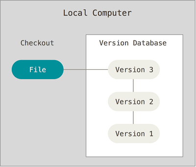
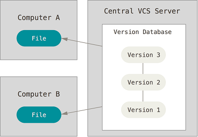
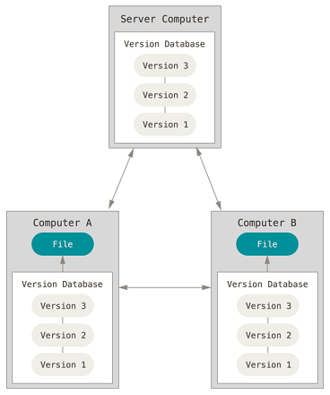
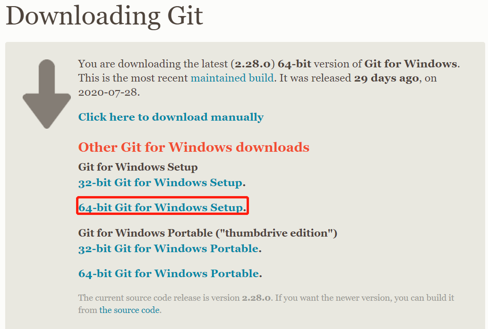
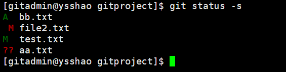
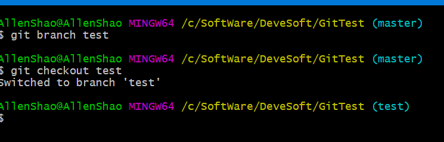
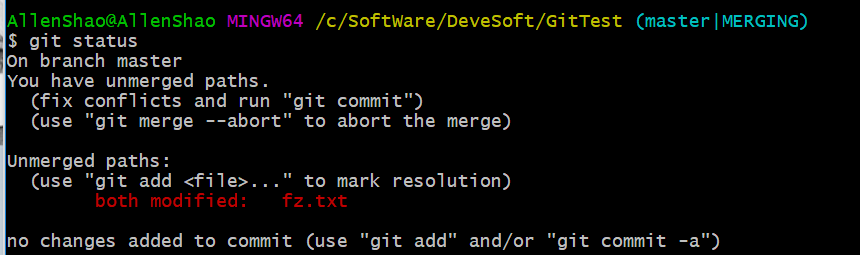
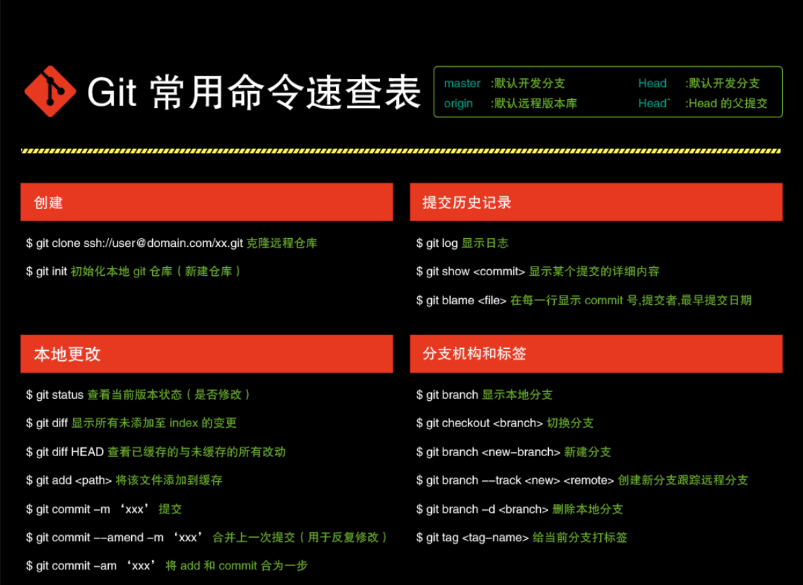
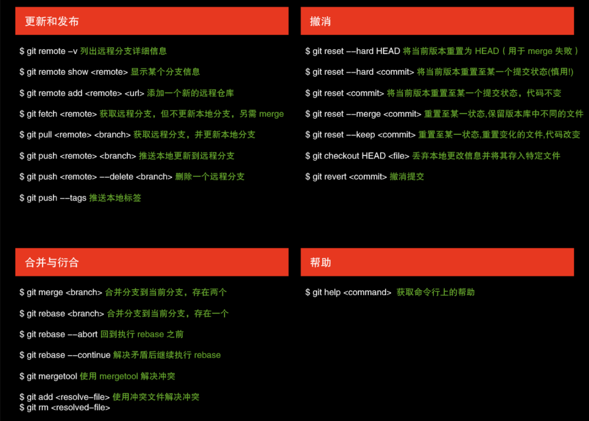

# Git使用指南

## Git简介

​	Git是Linux之父Linus的第二个伟大的作品，它最早是在Linux上开发的，被用来管理Linux核心的源代码。后来慢慢地有人将其移植到了Unix、Windows、Max OS等操作系统中。

​	Git是一个分布式的版本控制系统，与集中式的版本控制系统不同的是，每个人都工作在通过克隆建立的本地版本库中。也就是说每个人都拥有一个完整的版本库，查看提交日志、提交、创建里程碑和分支、合并分支、回退等所有操作都直接在本地完成而不需要网络连接。

​	对于Git仓库来说，每个人都有一个独立完整的仓库，所谓的远程仓库或是服务器仓库其实也是一个仓库，只不过这台主机24小时运行，它是一个稳定的仓库，供他人克隆、推送，也从服务器仓库中拉取别人的提交。

Git是目前世界上最先进的分布式版本控制系统，没有之一，对，没有之一!

### 关于版本控制

版本控制是一种记录一个或若干文件内容变化，以便将来查阅特定版本修订情况的系统。 除了项目源代码，你可以对任何类型的文件进行版本控制。

有了它你就可以将某个文件回溯到之前的状态，甚至将整个项目都回退到过去某个时间点的状态，你可以比较文件的变化细节，查出最后是谁修改了哪个地方，从而找出导致怪异问题出现的原因，又是谁在何时报告了某个功能缺陷等等。

### 本地版本控制系统

许多人习惯用复制整个项目目录的方式来保存不同的版本，或许还会改名加上备份时间以示区别。 这么做唯一的好处就是简单，但是特别容易犯错。 有时候会混淆所在的工作目录，一不小心会写错文件或者覆盖意想外的文件。

为了解决这个问题，人们很久以前就开发了许多种本地版本控制系统，大多都是采用某种简单的数据库来记录文件的历次更新差异。



### 集中化的版本控制系统

接下来人们又遇到一个问题，如何让在不同系统上的开发者协同工作？ 于是，集中化的版本控制系统（Centralized Version Control Systems，简称 CVCS）应运而生。 

集中化的版本控制系统都有一个单一的集中管理的服务器，保存所有文件的修订版本，而协同工作的人们都通过客户端连到这台服务器，取出最新的文件或者提交更新。



这么做虽然解决了本地版本控制系统无法让在不同系统上的开发者协同工作的诟病，但也还是存在下面的问题：

- **单点故障：** 中央服务器宕机，则其他人无法使用；如果中心数据库磁盘损坏有没有进行备份，你将丢失所有数据。本地版本控制系统也存在类似问题，只要整个项目的历史记录被保存在单一位置，就有丢失所有历史更新记录的风险。
- **必须联网才能工作：** 受网络状况、带宽影响。

### 分布式版本控制系统

于是分布式版本控制系统（Distributed Version Control System，简称 DVCS）面世了。 Git 就是一个典型的分布式版本控制系统。

这类系统，客户端并不只提取最新版本的文件快照，而是把代码仓库完整地镜像下来。 这么一来，任何一处协同工作用的服务器发生故障，事后都可以用任何一个镜像出来的本地仓库恢复。 因为每一次的克隆操作，实际上都是一次对代码仓库的完整备份。



分布式版本控制系统可以不用联网就可以工作，因为每个人的电脑上都是完整的版本库，当你修改了某个文件后，你只需要将自己的修改推送给别人就可以了。但是，在实际使用分布式版本控制系统的时候，很少会直接进行推送修改，而是使用一台充当“中央服务器”的东西。这个服务器的作用仅仅是用来方便“交换”大家的修改，没有它大家也一样干活，只是交换修改不方便而已。

分布式版本控制系统的优势不单是不必联网这么简单，后面我们还会看到 Git 极其强大的分支管理等功能。

### Git 与其他版本管理系统的主要区别

 Git 在保存和对待各种信息的时候与其它版本控制系统有很大差异，尽管操作起来的命令形式非常相近，理解这些差异将有助于防止你使用中的困惑。

下面我们主要说一个关于 Git 其他版本管理系统的主要差别：**对待数据的方式**。

**Git采用的是直接记录快照的方式，而非差异比较。我后面会详细介绍这两种方式的差别。**

大部分版本控制系统（CVS、Subversion、Perforce、Bazaar 等等）都是以文件变更列表的方式存储信息，这类系统**将它们保存的信息看作是一组基本文件和每个文件随时间逐步累积的差异。**

具体原理如下图所示，理解起来其实很简单，每个我们对提交更新一个文件之后，系统记录都会记录这个文件做了哪些更新，以增量符号Δ(Delta)表示。


**我们怎样才能得到一个文件的最终版本呢？**

很简单，高中数学的基本知识，我们只需要将这些原文件和这些增加进行相加就行了。

**这种方式有什么问题呢？**

比如我们的增量特别特别多的话，如果我们要得到最终的文件是不是会耗费时间和性能。

Git 不按照以上方式对待或保存数据。 反之，Git 更像是把数据看作是对小型文件系统的一组快照。 每次你提交更新，或在 Git 中保存项目状态时，它主要对当时的全部文件制作一个快照并保存这个快照的索引。 为了高效，如果文件没有修改，Git 不再重新存储该文件，而是只保留一个链接指向之前存储的文件。 Git 对待数据更像是一个 **快照流**。


### Git 的三个区

工作区(working diretory) 用于修改文件
缓存区(stage) 是用来暂时存放工作区中修改的内容
提交历史（commit history） 提交代码的历史记录

**基本的 Git 工作流程如下：**

1. 在工作目录中修改文件。

2. 暂存文件，将文件的快照放入暂存区域。

3. 提交更新，找到暂存区域的文件，将快照永久性存储到 Git 仓库目录。

    
   
   
   

## Git 快速入门

### 安装Git

在官网https://git-scm.com/download/win下载  



下载完进行默认安装即可。安装完成后，在开始菜单里面找到 "Git --> Git Bash".

会弹出一个类似的命令窗口的东西，就说明Git安装成功。如下：

安装完成后，还需要最后一步设置，在命令行输入如下：

git config --global user.name "YOUR NAME"

git config --global user.email "YOUR EMAIL"

因为Git是分布式版本控制系统，所以需要填写用户名和邮箱作为一个标识。

注意：git config --global 参数，有了这个参数，表示你这台机器上所有的Git仓库都会使用这个配置，当然你也可以对某个仓库指定的不同的用户名和邮箱。

### 如何操作Git

#### 创建版本库

什么是版本库？版本库又名仓库，英文名repository,你可以简单的理解一个目录，这个目录里面的所有文件都可以被Git管理起来，每个文件的修改，删除，Git都能跟踪，以便任何时刻都可以追踪历史，或者在将来某个时刻还可以将文件”还原”。

**两种取得 Git 项目仓库的方法：**

1. 在现有目录中初始化仓库: 进入项目目录运行  `git init`  命令,该命令将创建一个名为 `.git` 的子目录。
2. 从一个服务器克隆一个现有的 Git 仓库: `git clone [url]` 自定义本地仓库的名字: `git clone [url]` directoryname 	

**添加文件到版本库：**

> 1. **使用git add 将文件添加到暂存区**,`git add filename ` (针对特定文件)、`git add *`(所有文件)、`git add *.txt`（支持通配符，所有 .txt 文件）
>
> 2. **使用`git status`查看当前仓库的修改状态**
>
> 3. 如果我们要看具体修改的是什么内容，使用`git diff`命令来查看
>
> 4. **提交更新:** `git commit -m "代码提交信息"` （每次准备提交前，先用 `git status` 看下，是不是都已暂存起来了， 然后再运行提交命令 `git commit`）
>
> 5. **跳过使用暂存区域更新的方式** : `git commit -a -m "代码提交信息"`。 `git commit` 加上 `-a` 选项，Git 就会自动把所有已经跟踪过的文件暂存起来一并提交，从而跳过 `git add` 步骤。
>
> 6. **移除文件** ：`git rm filename`  （从暂存区域移除，然后提交。）
>
> 7. **对文件重命名** ：`git mv README.md README`(这个命令相当于`mv README.md README`、`git rm README.md`、`git add README` 这三条命令的集合)
>
>    查看状态补充：`git status -s`
>
>    - 新添加的未跟踪文件前面有 ?? 标记，
>
>    - 新添加到暂存区中的文件前面有 A 标记，
>
>    - 修改过的文件前面有 M 标记。
>
>    - 出现在右边的 M 表示该文件被修改了但是还没放入暂存区，
>
>    - 出现在靠左边的 M 表示该文件被修改了并放入了暂存区。
>
>    - MM表示工作区被修改并提交到暂存区后又在工作区中被修改了，所以在暂存区和工作区都有该文件被修改了的记录.
>
>      版本回退

> 使用`git log `查看提交的历史记录。
>
> 使用`git reflog ` 可以查看所有分支的所有操作记录.
>
> 现在我想使用版本回退操作，我想把当前的版本回退到上一个版本，要使用什么命令呢？可以使用如下2种命令。
>
> 第一种是：git reset --hard HEAD^ 那么如果要回退到上上个版本只需把HEAD^ 改成 HEAD^^ 以此类推。那如果要回退到前100个版本的话，使用上面的方法肯定不方便，我们可以使用下面的简便命令操作：git reset --hard HEAD~100 即可。
>
> 执行 git reset --hard HEAD~1，退回到上一个版本。
>
> 执行git reset --hard 版本号， 回退到固定的版本。

#### 撤销修改和删除文件操作

在提交之前，发现文件修改错误，现在我可以有如下几种方法可以做修改

撤消对文件的修改:`git checkout -- filename`

会撤销未提交暂存区和已提交暂存区的。

删除文件`git rm filename`

#### 查看提交历史

在提交了若干更新，又或者克隆了某个项目之后，你也许想回顾下提交历史。 完成这个任务最简单而又有效的工具是 `git log` 命令。`git log` 会按提交时间列出所有的更新，最近的更新排在最上面。

**可以添加一些参数来查看自己希望看到的内容：**

只看某个人的提交记录：

```shell
git log --author=bob
```

#### 创建与合并分支

分支是用来将特性开发绝缘开来的。在你创建仓库的时候，*master* 是“默认的”分支。在其他分支上进行开发，完成后再将它们合并到主分支上。

我们通常在开发新功能、修复一个紧急 bug 等等时候会选择创建分支。单分支开发好还是多分支开发好，还是要看具体场景来说。

> 查看分支：git branch
>
> 创建分支：git branch name
>
> 切换分支：git checkout name
>
> 创建+切换分支：git checkout –b name
>
> 合并某分支到当前分支：git merge name
>
> 删除分支：git branch –d name

创建一个名字叫做 test 的分支

```console
git branch test
```

切换当前分支到 test（当你切换分支的时候，Git 会重置你的工作目录，使其看起来像回到了你在那个分支上最后一次提交的样子。 Git 会自动添加、删除、修改文件以确保此时你的工作目录和这个分支最后一次提交时的样子一模一样

```console
git checkout test
```

 

直接创建分支并切换

```console
git checkout -b testbranch
```

切换到主分支

```
git checkout master
```

合并分支(可能会有冲突)

```java
 git merge test
```

  如合并时出现冲突，先`git status`查看冲突的文件

 

内容中。Git用<<<<<<<，=======，>>>>>>>标记出不同分支的内容，其中<<<HEAD是指主分支修改的内容

其次是修改文件保证最终状态，进行保存提交即可。

删除分支

```
#把新建的分支删掉。
git branch -d testbranch
#删除远程分支
git push origin --delete xxx
```

将分支推送到远端仓库（推送成功后其他人可见）：

```
git push origin 
```

#### 推送改动到远程仓库

​     远程仓库是指托管在因特网或其他网络中的你的项目的版本库（GitHub/GitLib）。与他人协作涉及管理远程仓库以及根据需要推送或拉取数据。

- 如果你还没有克隆现有仓库，并欲将你的仓库连接到某个远程服务器，你可以使用如下命令添加：·`git remote add origin <server>` ,比如我们要让本地的一个仓库和 Github/GitLib 上创建的一个仓库关联可以这样`git remote add origin https:xxxx/test.git` 

- 将这些改动提交到远端仓库：`git push origin master` (可以把 *master* 换成你想要推送的任何分支)

  上面命令表示，将本地的master分支推送到origin主机的master分支。如果master不存在，则会被新建。

  如此你就能够将你的改动推送到所添加的服务器上去了。

#### Git多人协作

当你从远程库克隆时候，实际上Git自动把本地的master分支和远程的master分支对应起来了，并且远程库的默认名称是origin。

要查看远程库的信息 使用 git remote

要查看远程库的详细信息 使用 git remote –v

从远程仓库更新代码:git pull

推送到远程仓库： git push origin master

### 理解工作区与暂存区的区别

> 工作区：就是你在电脑上看到的目录，比如仓库目录里的文件(.git隐藏目录版本库除外)。或者以后需要再新建的目录文件等等都属于工作区范畴。
> 版本库(Repository)：工作区有一个隐藏目录.git,这个不属于工作区，这是版本库。其中版本库里面存了很多东西，其中最重要的就是stage(暂存区)，还有Git为我们自动创建了第一个分支master,以及指向master的一个指针HEAD。

### 常用操作命令





## 推荐阅读

- [Git 官方手册中文版](https://git-scm.com/book/zh/v2) 
- [Git教程](https://www.w3cschool.cn/git/git-uroc2pow.html)
