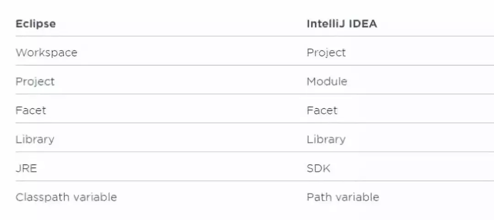
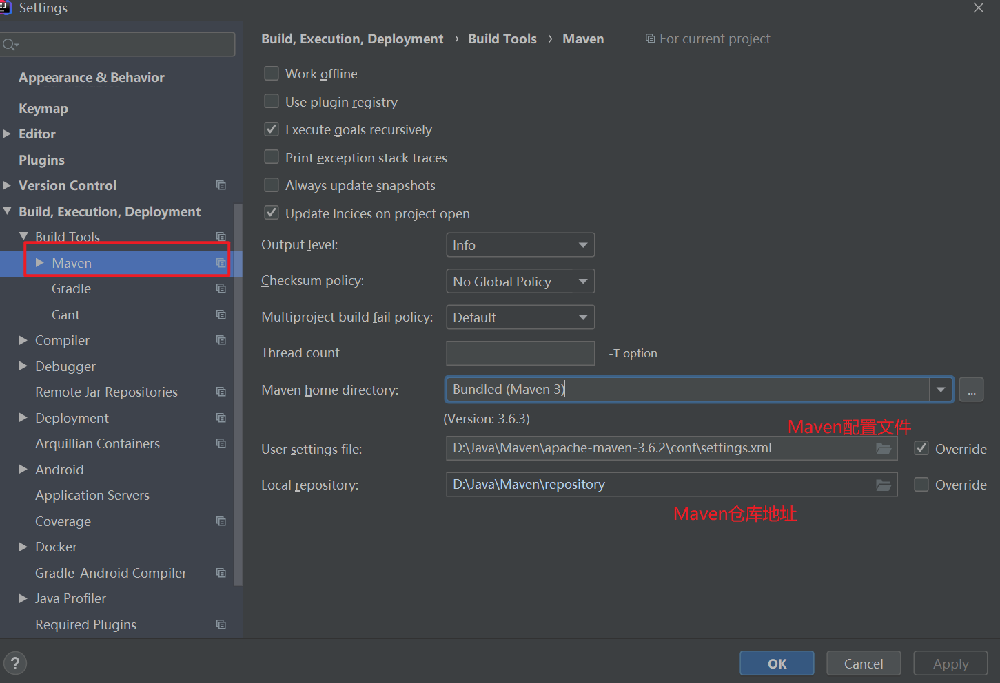
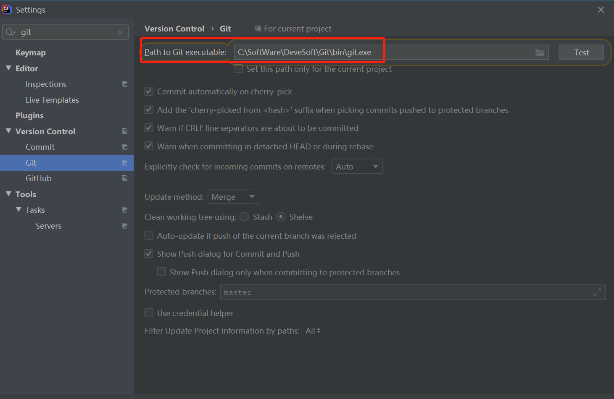
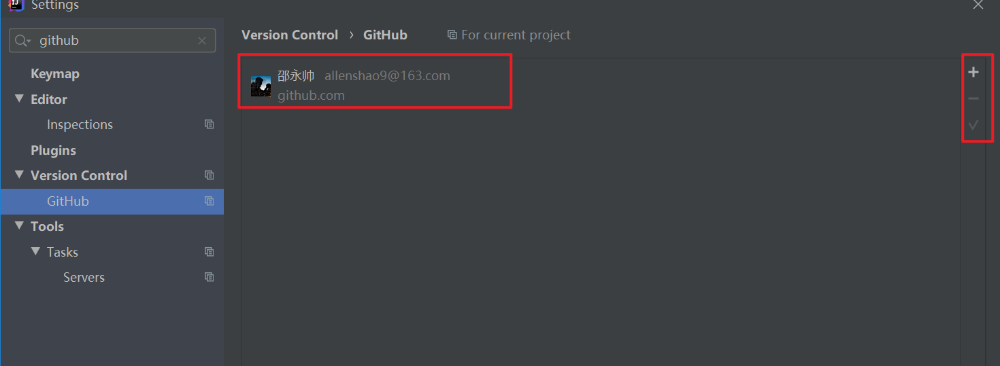
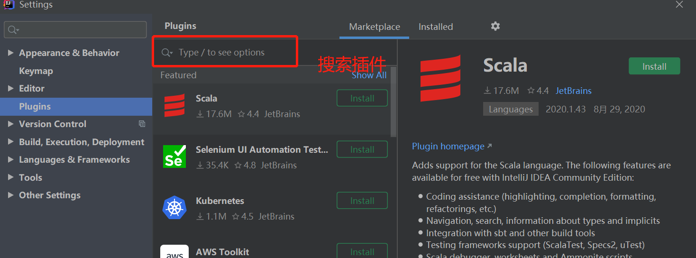

## IntelliJ IDEA 使用教程

## 前言

IDEA 全称 IntelliJ IDEA，是java编程语言开发的集成环境。

**IntelliJ IDEA** 被认为是当前 Java 开发效率最快的 IDE 工具，IDE在强大的插件功能支持下，诸如对Git和Maven的支持、代码自动提示等简直让人停不下来。

## IDEA的安装

直接百度IDEA，进入官网下载，随即安装即可。至于破解且各法在百度上皆有详细教程。

## IDEA VS Eclipse 核心术语比较

**由下图可见：**两者最大的转变就在于工作空间概念的转变，并且在IDEA当中，Project和  Module是作为两个不同的概念，对项目结构是具有重大意义的，这也恰恰是许多IDEA初学者觉得困扰的地方。

## 为什么要取消工作空间？

**简单来说，IDEA不需要设置工作空间，因为每一个Project都具备一个工作空间！！**对于每一个IDEA的项目工程（Project）而言，它的每一个子模块（Module）都可以使用独立的JDK和MAVEN配置。这对于传统项目迈向新项目的重构添加了极大的便利性，这种多元化的灵活性正是Eclipse所缺失的，因为开始Eclipse在初次使用时已经绑死了工作空间。

此外，很多新手都会问，为什么IDEA里面的子工程要称为Module ？

其实就是模块化的概念，作为聚合工程亦或普通的根目录，它称之为Project，而下面的子工程称为模块，每一个子模块之间可以相关联，也可以没有任何关联。

## IDEA的基本使用

### IDEA常用设置

主要是代码提示、字体、快捷键、常用技巧等

注意IDEA的全局设置和当前设置。

具体操作可参考：

- [IDEA常用设置](https://www.cnblogs.com/hkgov/p/11672498.html)

### IDEA设置MAVEN

### IDEA设置GIT

安装git核心程序：[下载地址](https://git-scm.com/download/win)

在IDEA中设置Git

绑定GitHub账号，如果是GitLab需要下载对应插件。

从GitHub上下载项目

点击VCS-->Get from Version Control...

输入地址，点击克隆即可。

克隆项目后，可以正常的提交、拉取项目，以及进行对应的分支合并管理。

[IDEA基础Git常用操作](https://www.w3cschool.cn/intellij_idea_doc/intellij_idea_doc-4aik2hgn.html)

### IDEA常用快捷键

**自动代码**

> 1. Ctrl+Alt+O 优化导入的类和包 
> 2. Alt+Insert 生成代码(如get,set方法,构造函数等)  或者右键（Generate） 
> 3. fori/sout/psvm + Tab 
> 4. Ctrl+Alt+T 生成try catch 或者 Alt+enter 
> 5. CTRL+ALT+T 把选中的代码放在 TRY{} IF{} ELSE{} 里 
> 6. Ctrl + O 重写方法 
> 7. Ctrl + I 实现方法 
> 8. Ctr+shift+U 大小写转化 
> 9. ALT+回车  导入包,自动修正 
> 10. ALT+/    代码提示 
> 11. CTRL+J   自动代码 
> 12. Ctrl+Shift+J，整合两行为一行 
> 13. CTRL+空格  代码提示 
> 14. CTRL+SHIFT+SPACE 自动补全代码 
> 15. CTRL+ALT+L 格式化代码 
> 16. CTRL+ALT+I 自动缩进 
> 17. CTRL+ALT+O 优化导入的类和包 
> 18. ALT+INSERT 生成代码(如GET,SET方法,构造函数等) 
> 19. CTRL+E   最近更改的代码 
> 20. CTRL+ALT+SPACE 类名或接口名提示 
> 21. CTRL+P  方法参数提示 
> 22. CTRL+Q，可以看到当前方法的声明 
> 23. Shift+F6 重构-重命名 (包、类、方法、变量、甚至注释等) 
> 24. Ctrl+Alt+V 提取变量 

**查询快捷键**

> 1. Ctrl＋Shift＋Backspace可以跳转到上次编辑的地 
> 2. CTRL+ALT+ left/right 前后导航编辑过的地方 
> 3. ALT+7 靠左窗口显示当前文件的结构 
> 4. Ctrl+F12 浮动显示当前文件的结构 
> 5. ALT+F7 找到你的函数或者变量或者类的所有引用到的地方 
> 6. CTRL+ALT+F7 找到你的函数或者变量或者类的所有引用到的地方 
> 7. Ctrl+Shift+Alt+N 查找类中的方法或变量 
> 8. 双击SHIFT 在项目的所有目录查找文件 
> 9. Ctrl+N  查找类 
> 10. Ctrl+Shift+N 查找文件 
> 11. CTRL+G  定位行 
> 12. CTRL+F  在当前窗口查找文本 
> 13. CTRL+SHIFT+F 在指定窗口查找文本 
> 14. CTRL+R  在 当前窗口替换文本 
> 15. CTRL+SHIFT+R 在指定窗口替换文本 
> 16. ALT+SHIFT+C 查找修改的文件 
> 17. CTRL+E  最近打开的文件 
> 18. F3  向下查找关键字出现位置 
> 19. SHIFT+F3 向上一个关键字出现位置 
> 20. 选中文本，按Alt+F3 ，高亮相同文本，F3逐个往下查找相同文本 
> 21. F4  查找变量来源 
> 22. CTRL+SHIFT+O 弹出显示查找内容 
> 23. Ctrl+W 选中代码，连续按会有其他效果 
> 24. F2 或Shift+F2 高亮错误或警告快速定位 
> 25. Ctrl+Up/Down 光标跳转到第一行或最后一行下 
> 26. Ctrl+B 快速打开光标处的类或方法 
> 27. CTRL+ALT+B 找所有的子类 
> 28. CTRL+SHIFT+B 找变量的类 
> 29. Ctrl+Shift+上下键 上下移动代码 
> 30. Ctrl+Alt+ left/right 返回至上次浏览的位置 
> 31. Ctrl+X 删除行 
> 32. Ctrl+D 复制行 
> 33. Ctrl+/ 或 Ctrl+Shift+/ 注释（// 或者/*...*/ ） 
> 34. Ctrl+H 显示类结构图 
> 35. Ctrl+Q 显示注释文档 
> 36. Alt+F1 查找代码所在位置 
> 37. Alt+1 快速打开或隐藏工程面板 
> 38. Alt+ left/right 切换代码视图 
> 39. ALT+ ↑/↓ 在方法间快速移动定位 
> 40. CTRL+ALT+ left/right 前后导航编辑过的地方 
> 41. Ctrl＋Shift＋Backspace可以跳转到上次编辑的地 
> 42. Alt+6  查找TODO 

**其他快捷键**

> 1. SHIFT+ENTER 另起一行 
> 2. CTRL+Z  倒退(撤销) 
> 3. CTRL+SHIFT+Z 向前(取消撤销) 
> 4. CTRL+ALT+F12 资源管理器打开文件夹 
> 5. ALT+F1  查找文件所在目录位置 
> 6. SHIFT+ALT+INSERT 竖编辑模式 
> 7. CTRL+F4 关闭当前窗口 
> 8. Ctrl+Alt+V，可以引入变量。例如：new String(); 自动导入变量定义 
> 9. Ctrl+~，快速切换方案（界面外观、代码风格、快捷键映射等菜单） 

### IDEA好用插件

**FindBugs**

Idea自带的检查工具已经很强大，如有需要也可以加上Alibaba Java Coding Guidelines的代码检查工具，但是，说白这些工具其实更多的是规范性检查，如果需要更深入的去检查异常，可以使用此插件~

**TranslationPlugin**

对于不经常使用英语的同学来说，对类，变量，方法想取一个合适的名字，此时发现自己的词汇早已还给老师 ，怎么办，这个插件能帮到你~

**Maven Helper**

主要功能如下：查找和排除冲突依赖项的简便方法，为包含当前文件或根模块的模块运行/调试maven目标的操作，运行/调试当前测试文件的操作

**Alibaba Java Coding Guidelines**

一款阿里巴巴公司试行的开发设计规范~ 

**Lombok**

Lombok能以简单的注解形式来简化java代码，提高开发人员的开发效率。例如开发中经常需要写的javabean，都需要花时间去添加相应的getter/setter，也许还要去写构造器、equals等方法，而且需要维护，当属性多时会出现大量的getter/setter方法，这些显得很冗长也没有太多技术含量，一旦修改属性，就容易出现忘记修改对应方法的失误。Lombok能通过注解的方式，在编译时自动为属性生成构造器、getter/setter、equals、hashcode、toString方法。

## 推荐阅读

**[IDEA教程](https://static.runoob.com/download%2FIntelliJ-IDEA13基础教程.pdf)**

**[IDEA使用教程](https://www.w3cschool.cn/intellij_idea_doc/)**