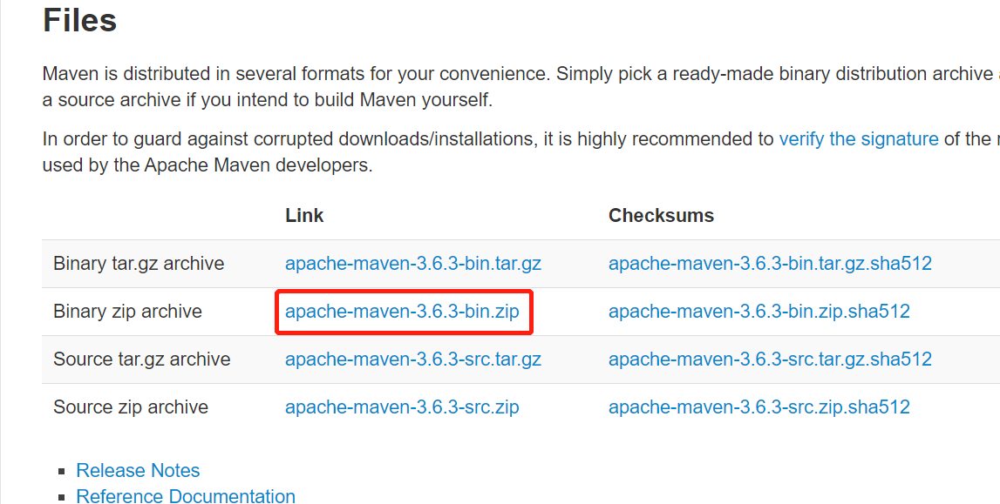

# Maven教程

## Maven 概述

### Maven 是什么？

Maven 是一个项目管理和整合工具。Maven 为开发者提供了一套完整的构建生命周期框架。开发团队几乎不用花多少时间就能够自动完成工程的基础构建配置，因为 Maven 使用了一个标准的目录结构和一个默认的构建生命周期。

在有多个开发团队环境的情况下，Maven 能够在很短的时间内使得每项工作都按照标准进行。因为大部分的工程配置操作都非常简单并且可复用，在创建报告、检查、构建和测试自动配置时，Maven 可以让开发者的工作变得更简单。

总的来说，Maven 简化了工程的构建过程，并对其标准化。它无缝衔接了编译、发布、文档生成、团队合作和其他任务。Maven 提高了重用性，负责了大部分构建相关的任务。

### Maven能解决什么问题？

**1.添加第三方 jar 包**

​	在今天的 JavaEE 开发领域，有大量的第三方框架和工具可以供我们使用。要使用这些 jar 包最简单的方法就是复制粘贴到 WEB-INF/lib 目录下。但是这会导致每次创建一个新的工程就需要将 jar 包重复复制到 lib 目录下，从而造成工作区中存在大量重复的文件，让我们的工程显得很臃肿。

而使用 Maven 后每个 jar 包本身只在本地仓库中保存一份，需要 jar 包的工程只需要以坐标的方式简单的引用一下就可以了。不仅极大的节约了存储空间，让项目更轻巧，更避免了重复文件太多而造成的混乱。

**2.jar 包之间的依赖关系**

​	jar 包往往不是孤立存在的，很多 jar 包都需要在其他 jar 包的支持下才能够正常工作，我们称之为jar 包之间的依赖关系。最典型的例子是：commons-fileupload-1.3.jar 依赖于 commons-io-2.0.1.jar，如果没有 IO 包，FileUpload 包就不能正常工作。

  那么问题来了，你知道你所使用的所有 jar 包的依赖关系吗？当你拿到一个新的从未使用过的 jar包，你如何得知他需要哪些 jar 包的支持呢？如果不了解这个情况，导入的 jar 包不够，那么现有的程序将不能正常工作。再进一步，当你的项目中需要用到上百个 jar 包时，你还会人为的，手工的逐一确认它们依赖的其他 jar 包吗？这简直是不可想象的。

  而引入 Maven 后，Maven 就可以替我们自动的将当前 jar 包所依赖的其他所有 jar 包全部导入进来，无需人工参与，节约了我们大量的时间和精力。用实际例子来说明就是：通过 Maven 导入commons-fileupload-1.3.jar 后，commons-io-2.0.1.jar 会被自动导入，程序员不必了解这个依赖关系。

**3.获取第三方 jar 包**

JavaEE 开发中需要使用到的 jar 包种类繁多，几乎每个 jar 包在其本身的官网上的获取方式都不尽相同。为了查找一个 jar 包找遍互联网，身心俱疲，没有经历过的人或许体会不到这种折磨。不仅如此，费劲心血找的 jar 包里有的时候并没有你需要的那个类，或者同名的类没有你要的方法——以不规范的方式获取的 jar 包也往往是不规范的。

  使用 Maven 我们可以享受到一个完全统一规范的 jar 包管理体系。你只需要在你的项目中以坐标的
 方式依赖一个 jar 包，Maven 就会自动从中央仓库进行下载，并同时下载这个 jar 包所依赖的其他 jar 包——规范、完整、准确！一次性解决所有问题！

**4.约定优于配置**

Maven 使用约定而不是配置，意味着开发者不需要再自己创建构建过程。

开发者不需要再关心每一个配置细节。Maven 为工程提供了合理的默认行为。当创建 Maven 工程时，Maven 会创建默认的工程结构。开发者只需要合理的放置文件，而在 pom.xml 中不再需要定义任何配置。

Maven项目的目录约定

```
MavenProjectRoot(项目根目录)
  |----src
  |   |----main
  |   |     |----java ——存放项目的.java文件
  |   |     |----resources ——存放项目资源文件，如spring, hibernate配置文件
  |   |----test
  |   |     |----java ——存放所有测试.java文件，如JUnit测试类
  |   |     |----resources ——存放项目资源文件，如spring, hibernate配置文件
  |----target ——项目输出位置
  |----pom.xml ----用于标识该项目是一个Maven项目
```

为了构建工程，Maven 为开发者提供了选项来配置生命周期目标和工程依赖（依赖于 Maven 的插件扩展功能和默认的约定）。大部分的工程管理和构建相关的任务是由 Maven 插件完成的。

## Maven安装

Maven 是一个基于 Java 的工具，安装MAVNE需要注意 JDK版本。

>   Maven 3.3 要求 JDK 1.7 或以上 Maven 3.2 要求 JDK 1.6 或以上 Maven 3.0/3.1 要求 JDK 1.5 或以上

[下载 Maven](http://maven.apache.org/download.html)



配置环境变量

```
M2_HOME=C:\Program Files\Apache Software Foundation\apache-maven-3.2.5
M2=%M2_HOME%\bin
MAVEN_OPTS=-Xms256m -Xmx512m
```

验证 Maven 安装：mvn --v

Maven安装后的文件结构

> - bin：保存Maven的可执行命令。其中`mvn`和`mvn.bat`就是执行Maven工具的命令。
> - boot：该目录只包含一个`plexus-classworlds-2.6.0.jar`。`plexus-classworlds`是一个类加载器框架，与默认的Java类加载器相比，它提供了更丰富的语法以方便配置，Maven使用该框架加载自己的类库。通常无需理会。
> - conf：保存Maven配置文件的目录，该目录包含`settings.xml`文件，该文件用于设置Maven的全局行为。通常建议将该文件复制到`~/.m2/`目录下（~表示用户目录），这样可以只设置当前用户的Maven行为。
> - lib：该目录包含了所有Maven运行时需要的类库，Maven本身是分模块开发的，因此用户能看到诸如`maven-core-3.6.3.jar`、`maven-repository-metadata-3.6.3.jar`等文件。此外，还包含Maven所依赖的第三方类库。
> - LICENSE、README.txt等说明文档。

建议在settings.xml中添加如下代码，因为使用Maven过程中涉及很多插件的下载，而这些插件都是在国外Maven的中央仓库，下载会很缓慢，所以添加国内的镜像的话下载速度会起飞。

在settings标签下添加

```xml
<mirrors>
  <mirror>
    <id>alimaven</id>
    <name>aliyun maven</name>
    <url>http://maven.aliyun.com/nexus/content/groups/public/</url>
    <mirrorOf>central</mirrorOf>        
  </mirror>
</mirrors>
```

设置Mavne的本地仓库地址

- localRepository：该参数通过``元素设置，该元素的内容是一个路径字符串，该路径用于设置Maven的本地资源库的路径。如果用户不设置该参数，Maven本地资源库默认保存在用户Home目录的`m2/repository`路径下。Windows系统建议将该Maven本机资源库设置到其他路径。

设置Maven行为有两种方式

- 全局方式：通过Maven安装目录下的`conf/settings.xml`文件进行设置
- 当前用户方式：通过用户Home目录`C:\Users\用户名`的`m2`目录下的`settings.xml`文件进行设置

## Maven 仓库

Maven 仓库是项目中依赖的第三方库，这个库所在的位置叫做仓库。

在 Maven 中，任何一个依赖、插件或者项目构建的输出，都可以称之为构件。

Maven 仓库能帮助我们管理构件（主要是JAR），它就是放置所有JAR文件（WAR，ZIP，POM等等）的地方。

Maven 仓库有三种类型：

- 本地（local）
- 中央（central）
- 远程（remote）

### 本地仓库

Maven 的本地仓库，在安装 Maven 后并不会创建，它是在第一次执行 maven 命令的时候才被创建。

运行 Maven 的时候，Maven 所需要的任何构件都是直接从本地仓库获取的。如果本地仓库没有，它会首先尝试从远程仓库下载构件至本地仓库，然后再使用本地仓库的构件。

本地仓库地址位于`settting.xml中localRepository指导的路径`

### 中央仓库

Maven 中央仓库是由 Maven 社区提供的仓库，其中包含了大量常用的库。

中央仓库的关键概念：

- 这个仓库由 Maven 社区管理。
- 不需要配置。
- 需要通过网络才能访问。

Maven中央仓库地址：https://mvnrepository.com/

### 远程仓库

如果 Maven 在中央仓库中也找不到依赖的文件，它会停止构建过程并输出错误信息到控制台。为避免这种情况，Maven 提供了远程仓库的概念，它是开发人员自己定制仓库，包含了所需要的代码库或者其他工程中用到的 jar 文件。

> 当前主流的maven私服：
>
> 1.Apache的Archiva
>
> 2.JFrog的Artifactory
>
> 3.Sonatype的Nexus
>
> 推荐使用Nexus作为私服的仓库搭建。

## Maven 构建生命周期

Maven 构建生命周期定义了一个项目构建跟发布的过程。

一个典型的 Maven 构建（build）生命周期是由以下几个阶段的序列组成的：

| 阶段         | 处理     | 描述                                                     |
| :----------- | :------- | :------------------------------------------------------- |
| 清理clean    | 清理     | 清理target项目的文件夹内容                               |
| 编译 compile | 执行编译 | 源代码编译在此阶段完成                                   |
| 测试 Test    | 测试     | 使用适当的单元测试框架（例如JUnit）运行测试。            |
| 包装 package | 打包     | 创建JAR/WAR包如在 pom.xml 中定义提及的包                 |
| 检查 verify  | 检查     | 对集成测试的结果进行检查，以保证质量达标                 |
| 安装 install | 安装     | 安装打包的项目到本地仓库，以供其他项目使用               |
| 部署 deploy  | 部署     | 拷贝最终的工程包到远程仓库中，以共享给其他开发人员和工程 |

## Maven构建项目

Maven 使用原型 **archetype** 插件创建项目。要创建一个简单的 Java 应用，我们将使用 **maven-archetype-quickstart** 插件。 web项目插件**maven-archetype-webapp**

```shell
mvn archetype:generate "-DgroupId=com.companyname.bank" "-DartifactId=consumerBanking" "-DarchetypeArtifactId=maven-archetype-quickstart" "-DinteractiveMode=false"
```

参数说明：

- **-DgourpId**: 组织名，公司网址的反写 + 项目名称
- **-DartifactId**: 项目名-模块名
- **-DarchetypeArtifactId**: 指定 ArchetypeId，maven-archetype-quickstart，创建一个简单的 Java 应用
- **-DinteractiveMode**: 是否使用交互模式

## Maven使用

### Maven的坐标

POM需要为项目提供一个唯一标识符，这个标识符就被称为Maven坐标。

需要说明的是每个工程应该只有一个 POM 文件。

- 所有的 POM 文件需要 **project** 元素和三个必须的字段：**groupId, artifactId,version**。
- 在仓库中的工程标识为 **groupId:artifactId:version**
- POM.xml 的根元素是 **project**，它有三个主要的子节点：

| 节点       | 描述                                                         |
| ---------- | ------------------------------------------------------------ |
| groupId    | 这是工程组的标识。它在一个组织或者项目中通常是唯一的。例如，一个银行组织 com.company.bank 拥有所有的和银行相关的项目。 |
| artifactId | 这是工程的标识。它通常是工程的名称。例如，消费者银行。groupId 和 artifactId 一起定义了 artifact 在仓库中的位置。 |
| version    | 这是工程的版本号。在 artifact 的仓库中，它用来区分不同的版本。例如： com.company.bank:consumer-banking:1.0<br>com.company.bank:consumer-banking:1.1. |

### Maven引入Jar包

```xml
<dependencies>
    <!-- 在这里添加你的依赖 -->
    <dependency>
        <groupId>ldapjdk</groupId>  <!-- 库名称，也可以自定义 -->
        <artifactId>ldapjdk</artifactId>    <!--库名称，也可以自定义-->
        <version>1.0</version> <!--版本号-->
        <scope>system</scope> <!--作用域-->
        <systemPath>${basedir}\src\lib\ldapjdk.jar</systemPath> <!--项目根目录下的lib文件夹下-->
    </dependency> 
</dependencies>
```

## Maven 依赖管理

Maven 一个核心的特性就是依赖管理。当我们处理多模块的项目（包含成百上千个模块或者子项目），模块间的依赖关系就变得非常复杂，管理也变得很困难。

| 功能     | 功能描述                                                     |
| :------- | :----------------------------------------------------------- |
| 依赖调节 | 决定当多个手动创建的版本同时出现时，哪个依赖版本将会被使用。 如果两个依赖版本在依赖树里的深度是一样的时候，第一个被声明的依赖将会被使用。 |
| 依赖管理 | 直接的指定手动创建的某个版本被使用。例如当一个工程 C 在自己的依赖管理模块包含工程 B，即 B 依赖于 A， 那么 A 即可指定在 B 被引用时所使用的版本。 |
| 依赖范围 | 包含在构建过程每个阶段的依赖。                               |
| 依赖排除 | 任何可传递的依赖都可以通过 "exclusion" 元素被排除在外。举例说明，A 依赖 B， B 依赖 C，因此 A 可以标记 C 为 "被排除的"。 |
| 依赖可选 | 任何可传递的依赖可以被标记为可选的，通过使用 "optional" 元素。例如：A 依赖 B， B 依赖 C。因此，B 可以标记 C 为可选的， 这样 A 就可以不再使用 C。 |

**依赖范围**

compile,test,provided,runtime,system 五种状态。

| 范围     | 描述                                                         |
| :------- | :----------------------------------------------------------- |
| 编译阶段 | 该范围表明相关依赖是只在项目的类路径下有效。默认取值。       |
| 供应阶段 | 该范围表明相关依赖是由运行时的 JDK 或者 网络服务器提供的。   |
| 运行阶段 | 该范围表明相关依赖在编译阶段不是必须的，但是在执行阶段是必须的。 |
| 测试阶段 | 该范围表明相关依赖只在测试编译阶段和执行阶段。               |
| 系统阶段 | 该范围表明你需要提供一个系统路径。                           |
| 导入阶段 | 该范围只在依赖是一个 pom 里定义的依赖时使用。同时，当前项目的POM 文件的 部分定义的依赖关系可以取代某特定的 POM。 |

## POM常用标签

```xml
<?xml version="1.0" encoding="utf-8"?>
<project xmlns="http://maven.apache.org/POM/4.0.0" xmlns:xsi="http://www.w3.org/2001/XMLSchema-instance" xsi:schemaLocation="http://maven.apache.org/POM/4.0.0 http://maven.apache.org/xsd/maven-4.0.0.xsd">  
  <!-- 指定了pom版本（固定） -->  
  <modelVersion>4.0.0</modelVersion>  
  <groupId>反写的公司网址+项目名</groupId>  
  <artifactId>项目名+模块名</artifactId>  
      <!--
    snapshot 快照版
    alpha 内测版
    beta 公测版
    Release 稳定版
    GA 正式发布版
    -->  
  <version>当前项目版本号：大版本号.分支版本号.小版本号</version>  
  <!-- jar包、war包、zip包、pom等 -->  
  <packaging>打包方式（不指定时默认为jar）</packaging>  
  <name>项目描述名</name>  
  <url>项目地址</url>  
  <description>项目描述</description>  
  <developers>开发人员列表</developers>  
  <licenses>许可证信息</licenses>  
  <organization>机构</organization>  
  <!-- 依赖信息 -->  
  <dependencies> 
    <dependency> 
      <!-- 依赖坐标 -->  
      <groupId/>  
      <artifactId/>  
      <version/>  
      <type/>  
      <scope>依赖范围</scope>  
      <optinal>设置依赖是否可选（默认为false）</optinal>  
      <!-- 排除依赖传递列表 -->  
      <!-- A依赖B，B依赖C时。可以配置使A不依赖C -->  
      <exclusions> 
        <exclusion> 
          <!-- 要排除的依赖的坐标 -->  
          <groupId/>  
          <artifactId/> 
        </exclusion> 
      </exclusions> 
    </dependency> 
  </dependencies>  
  <!-- 依赖管理 -->  
  <!-- 定义在父模块中，只定义，并不会真正执行 -->  
  <dependencyManagement> 
    <dependencies> 
      <dependency/> 
    </dependencies> 
  </dependencyManagement>  
  <!-- 构建 -->  
  <build> 
    <!-- 插件列表 -->  
    <plugins> 
      <plugin> 
        <!-- 插件坐标 -->  
        <groupId/>  
        <artifactId/>  
        <version/> 
      </plugin> 
    </plugins> 
  </build>  
  <!-- 对父模块的继承 -->  
  <parent/>  
  <!-- 指定多个模块一起编译 -->  
  <modules> 
    <module/> 
  </modules> 
</project>

```

## POM 标签大全详解

```
<project xmlns="http://maven.apache.org/POM/4.0.0" xmlns:xsi="http://www.w3.org/2001/XMLSchema-instance"
    xsi:schemaLocation="http://maven.apache.org/POM/4.0.0http://maven.apache.org/maven-v4_0_0.xsd">
    <!--父项目的坐标。如果项目中没有规定某个元素的值，那么父项目中的对应值即为项目的默认值。 坐标包括group ID，artifact ID和 
        version。 -->
    <parent>
        <!--被继承的父项目的构件标识符 -->
        <artifactId />
        <!--被继承的父项目的全球唯一标识符 -->
        <groupId />
        <!--被继承的父项目的版本 -->
        <version />
        <!-- 父项目的pom.xml文件的相对路径。相对路径允许你选择一个不同的路径。默认值是../pom.xml。Maven首先在构建当前项目的地方寻找父项 
            目的pom，其次在文件系统的这个位置（relativePath位置），然后在本地仓库，最后在远程仓库寻找父项目的pom。 -->
        <relativePath />
    </parent>
    <!--声明项目描述符遵循哪一个POM模型版本。模型本身的版本很少改变，虽然如此，但它仍然是必不可少的，这是为了当Maven引入了新的特性或者其他模型变更的时候，确保稳定性。 -->
    <modelVersion>4.0.0</modelVersion>
    <!--项目的全球唯一标识符，通常使用全限定的包名区分该项目和其他项目。并且构建时生成的路径也是由此生成， 如com.mycompany.app生成的相对路径为：/com/mycompany/app -->
    <groupId>asia.banseon</groupId>
    <!-- 构件的标识符，它和group ID一起唯一标识一个构件。换句话说，你不能有两个不同的项目拥有同样的artifact ID和groupID；在某个 
        特定的group ID下，artifact ID也必须是唯一的。构件是项目产生的或使用的一个东西，Maven为项目产生的构件包括：JARs，源 码，二进制发布和WARs等。 -->
    <artifactId>banseon-maven2</artifactId>
    <!--项目产生的构件类型，例如jar、war、ear、pom。插件可以创建他们自己的构件类型，所以前面列的不是全部构件类型 -->
    <packaging>jar</packaging>
    <!--项目当前版本，格式为:主版本.次版本.增量版本-限定版本号 -->
    <version>1.0-SNAPSHOT</version>
    <!--项目的名称, Maven产生的文档用 -->
    <name>banseon-maven</name>
    <!--项目主页的URL, Maven产生的文档用 -->
    <url>http://www.baidu.com/banseon</url>
    <!-- 项目的详细描述, Maven 产生的文档用。 当这个元素能够用HTML格式描述时（例如，CDATA中的文本会被解析器忽略，就可以包含HTML标 
        签）， 不鼓励使用纯文本描述。如果你需要修改产生的web站点的索引页面，你应该修改你自己的索引页文件，而不是调整这里的文档。 -->
    <description>A maven project to study maven.</description>
    <!--描述了这个项目构建环境中的前提条件。 -->
    <prerequisites>
        <!--构建该项目或使用该插件所需要的Maven的最低版本 -->
        <maven />
    </prerequisites>
    <!--项目的问题管理系统(Bugzilla, Jira, Scarab,或任何你喜欢的问题管理系统)的名称和URL，本例为 jira -->
    <issueManagement>
        <!--问题管理系统（例如jira）的名字， -->
        <system>jira</system>
        <!--该项目使用的问题管理系统的URL -->
        <url>http://jira.baidu.com/banseon</url>
    </issueManagement>
    <!--项目持续集成信息 -->
    <ciManagement>
        <!--持续集成系统的名字，例如continuum -->
        <system />
        <!--该项目使用的持续集成系统的URL（如果持续集成系统有web接口的话）。 -->
        <url />
        <!--构建完成时，需要通知的开发者/用户的配置项。包括被通知者信息和通知条件（错误，失败，成功，警告） -->
        <notifiers>
            <!--配置一种方式，当构建中断时，以该方式通知用户/开发者 -->
            <notifier>
                <!--传送通知的途径 -->
                <type />
                <!--发生错误时是否通知 -->
                <sendOnError />
                <!--构建失败时是否通知 -->
                <sendOnFailure />
                <!--构建成功时是否通知 -->
                <sendOnSuccess />
                <!--发生警告时是否通知 -->
                <sendOnWarning />
                <!--不赞成使用。通知发送到哪里 -->
                <address />
                <!--扩展配置项 -->
                <configuration />
            </notifier>
        </notifiers>
    </ciManagement>
    <!--项目创建年份，4位数字。当产生版权信息时需要使用这个值。 -->
    <inceptionYear />
    <!--项目相关邮件列表信息 -->
    <mailingLists>
        <!--该元素描述了项目相关的所有邮件列表。自动产生的网站引用这些信息。 -->
        <mailingList>
            <!--邮件的名称 -->
            <name>Demo</name>
            <!--发送邮件的地址或链接，如果是邮件地址，创建文档时，mailto: 链接会被自动创建 -->
            <post>banseon@126.com</post>
            <!--订阅邮件的地址或链接，如果是邮件地址，创建文档时，mailto: 链接会被自动创建 -->
            <subscribe>banseon@126.com</subscribe>
            <!--取消订阅邮件的地址或链接，如果是邮件地址，创建文档时，mailto: 链接会被自动创建 -->
            <unsubscribe>banseon@126.com</unsubscribe>
            <!--你可以浏览邮件信息的URL -->
            <archive>http:/hi.baidu.com/banseon/demo/dev/</archive>
        </mailingList>
    </mailingLists>
    <!--项目开发者列表 -->
    <developers>
        <!--某个项目开发者的信息 -->
        <developer>
            <!--SCM里项目开发者的唯一标识符 -->
            <id>HELLO WORLD</id>
            <!--项目开发者的全名 -->
            <name>banseon</name>
            <!--项目开发者的email -->
            <email>banseon@126.com</email>
            <!--项目开发者的主页的URL -->
            <url />
            <!--项目开发者在项目中扮演的角色，角色元素描述了各种角色 -->
            <roles>
                <role>Project Manager</role>
                <role>Architect</role>
            </roles>
            <!--项目开发者所属组织 -->
            <organization>demo</organization>
            <!--项目开发者所属组织的URL -->
            <organizationUrl>http://hi.baidu.com/banseon</organizationUrl>
            <!--项目开发者属性，如即时消息如何处理等 -->
            <properties>
                <dept>No</dept>
            </properties>
            <!--项目开发者所在时区， -11到12范围内的整数。 -->
            <timezone>-5</timezone>
        </developer>
    </developers>
    <!--项目的其他贡献者列表 -->
    <contributors>
        <!--项目的其他贡献者。参见developers/developer元素 -->
        <contributor>
            <name />
            <email />
            <url />
            <organization />
            <organizationUrl />
            <roles />
            <timezone />
            <properties />
        </contributor>
    </contributors>
    <!--该元素描述了项目所有License列表。 应该只列出该项目的license列表，不要列出依赖项目的 license列表。如果列出多个license，用户可以选择它们中的一个而不是接受所有license。 -->
    <licenses>
        <!--描述了项目的license，用于生成项目的web站点的license页面，其他一些报表和validation也会用到该元素。 -->
        <license>
            <!--license用于法律上的名称 -->
            <name>Apache 2</name>
            <!--官方的license正文页面的URL -->
            <url>http://www.baidu.com/banseon/LICENSE-2.0.txt</url>
            <!--项目分发的主要方式： repo，可以从Maven库下载 manual， 用户必须手动下载和安装依赖 -->
            <distribution>repo</distribution>
            <!--关于license的补充信息 -->
            <comments>A business-friendly OSS license</comments>
        </license>
    </licenses>
    <!--SCM(Source Control Management)标签允许你配置你的代码库，供Maven web站点和其它插件使用。 -->
    <scm>
        <!--SCM的URL,该URL描述了版本库和如何连接到版本库。欲知详情，请看SCMs提供的URL格式和列表。该连接只读。 -->
        <connection>
            scm:svn:http://svn.baidu.com/banseon/maven/banseon/banseon-maven2-trunk(dao-trunk)
        </connection>
        <!--给开发者使用的，类似connection元素。即该连接不仅仅只读 -->
        <developerConnection>
            scm:svn:http://svn.baidu.com/banseon/maven/banseon/dao-trunk
        </developerConnection>
        <!--当前代码的标签，在开发阶段默认为HEAD -->
        <tag />
        <!--指向项目的可浏览SCM库（例如ViewVC或者Fisheye）的URL。 -->
        <url>http://svn.baidu.com/banseon</url>
    </scm>
    <!--描述项目所属组织的各种属性。Maven产生的文档用 -->
    <organization>
        <!--组织的全名 -->
        <name>demo</name>
        <!--组织主页的URL -->
        <url>http://www.baidu.com/banseon</url>
    </organization>
    <!--构建项目需要的信息 -->
    <build>
        <!--该元素设置了项目源码目录，当构建项目的时候，构建系统会编译目录里的源码。该路径是相对于pom.xml的相对路径。 -->
        <sourceDirectory />
        <!--该元素设置了项目脚本源码目录，该目录和源码目录不同：绝大多数情况下，该目录下的内容 会被拷贝到输出目录(因为脚本是被解释的，而不是被编译的)。 -->
        <scriptSourceDirectory />
        <!--该元素设置了项目单元测试使用的源码目录，当测试项目的时候，构建系统会编译目录里的源码。该路径是相对于pom.xml的相对路径。 -->
        <testSourceDirectory />
        <!--被编译过的应用程序class文件存放的目录。 -->
        <outputDirectory />
        <!--被编译过的测试class文件存放的目录。 -->
        <testOutputDirectory />
        <!--使用来自该项目的一系列构建扩展 -->
        <extensions>
            <!--描述使用到的构建扩展。 -->
            <extension>
                <!--构建扩展的groupId -->
                <groupId />
                <!--构建扩展的artifactId -->
                <artifactId />
                <!--构建扩展的版本 -->
                <version />
            </extension>
        </extensions>
        <!--当项目没有规定目标（Maven2 叫做阶段）时的默认值 -->
        <defaultGoal />
        <!--这个元素描述了项目相关的所有资源路径列表，例如和项目相关的属性文件，这些资源被包含在最终的打包文件里。 -->
        <resources>
            <!--这个元素描述了项目相关或测试相关的所有资源路径 -->
            <resource>
                <!-- 描述了资源的目标路径。该路径相对target/classes目录（例如${project.build.outputDirectory}）。举个例 
                    子，如果你想资源在特定的包里(org.apache.maven.messages)，你就必须该元素设置为org/apache/maven /messages。然而，如果你只是想把资源放到源码目录结构里，就不需要该配置。 -->
                <targetPath />
                <!--是否使用参数值代替参数名。参数值取自properties元素或者文件里配置的属性，文件在filters元素里列出。 -->
                <filtering />
                <!--描述存放资源的目录，该路径相对POM路径 -->
                <directory />
                <!--包含的模式列表，例如**/*.xml. -->
                <includes />
                <!--排除的模式列表，例如**/*.xml -->
                <excludes />
            </resource>
        </resources>
        <!--这个元素描述了单元测试相关的所有资源路径，例如和单元测试相关的属性文件。 -->
        <testResources>
            <!--这个元素描述了测试相关的所有资源路径，参见build/resources/resource元素的说明 -->
            <testResource>
                <targetPath />
                <filtering />
                <directory />
                <includes />
                <excludes />
            </testResource>
        </testResources>
        <!--构建产生的所有文件存放的目录 -->
        <directory />
        <!--产生的构件的文件名，默认值是${artifactId}-${version}。 -->
        <finalName />
        <!--当filtering开关打开时，使用到的过滤器属性文件列表 -->
        <filters />
        <!--子项目可以引用的默认插件信息。该插件配置项直到被引用时才会被解析或绑定到生命周期。给定插件的任何本地配置都会覆盖这里的配置 -->
        <pluginManagement>
            <!--使用的插件列表 。 -->
            <plugins>
                <!--plugin元素包含描述插件所需要的信息。 -->
                <plugin>
                    <!--插件在仓库里的group ID -->
                    <groupId />
                    <!--插件在仓库里的artifact ID -->
                    <artifactId />
                    <!--被使用的插件的版本（或版本范围） -->
                    <version />
                    <!--是否从该插件下载Maven扩展（例如打包和类型处理器），由于性能原因，只有在真需要下载时，该元素才被设置成enabled。 -->
                    <extensions />
                    <!--在构建生命周期中执行一组目标的配置。每个目标可能有不同的配置。 -->
                    <executions>
                        <!--execution元素包含了插件执行需要的信息 -->
                        <execution>
                            <!--执行目标的标识符，用于标识构建过程中的目标，或者匹配继承过程中需要合并的执行目标 -->
                            <id />
                            <!--绑定了目标的构建生命周期阶段，如果省略，目标会被绑定到源数据里配置的默认阶段 -->
                            <phase />
                            <!--配置的执行目标 -->
                            <goals />
                            <!--配置是否被传播到子POM -->
                            <inherited />
                            <!--作为DOM对象的配置 -->
                            <configuration />
                        </execution>
                    </executions>
                    <!--项目引入插件所需要的额外依赖 -->
                    <dependencies>
                        <!--参见dependencies/dependency元素 -->
                        <dependency>
                            ......
                        </dependency>
                    </dependencies>
                    <!--任何配置是否被传播到子项目 -->
                    <inherited />
                    <!--作为DOM对象的配置 -->
                    <configuration />
                </plugin>
            </plugins>
        </pluginManagement>
        <!--使用的插件列表 -->
        <plugins>
            <!--参见build/pluginManagement/plugins/plugin元素 -->
            <plugin>
                <groupId />
                <artifactId />
                <version />
                <extensions />
                <executions>
                    <execution>
                        <id />
                        <phase />
                        <goals />
                        <inherited />
                        <configuration />
                    </execution>
                </executions>
                <dependencies>
                    <!--参见dependencies/dependency元素 -->
                    <dependency>
                        ......
                    </dependency>
                </dependencies>
                <goals />
                <inherited />
                <configuration />
            </plugin>
        </plugins>
    </build>
    <!--在列的项目构建profile，如果被激活，会修改构建处理 -->
    <profiles>
        <!--根据环境参数或命令行参数激活某个构建处理 -->
        <profile>
            <!--构建配置的唯一标识符。即用于命令行激活，也用于在继承时合并具有相同标识符的profile。 -->
            <id />
            <!--自动触发profile的条件逻辑。Activation是profile的开启钥匙。profile的力量来自于它 能够在某些特定的环境中自动使用某些特定的值；这些环境通过activation元素指定。activation元素并不是激活profile的唯一方式。 -->
            <activation>
                <!--profile默认是否激活的标志 -->
                <activeByDefault />
                <!--当匹配的jdk被检测到，profile被激活。例如，1.4激活JDK1.4，1.4.0_2，而!1.4激活所有版本不是以1.4开头的JDK。 -->
                <jdk />
                <!--当匹配的操作系统属性被检测到，profile被激活。os元素可以定义一些操作系统相关的属性。 -->
                <os>
                    <!--激活profile的操作系统的名字 -->
                    <name>Windows XP</name>
                    <!--激活profile的操作系统所属家族(如 'windows') -->
                    <family>Windows</family>
                    <!--激活profile的操作系统体系结构 -->
                    <arch>x86</arch>
                    <!--激活profile的操作系统版本 -->
                    <version>5.1.2600</version>
                </os>
                <!--如果Maven检测到某一个属性（其值可以在POM中通过${名称}引用），其拥有对应的名称和值，Profile就会被激活。如果值 字段是空的，那么存在属性名称字段就会激活profile，否则按区分大小写方式匹配属性值字段 -->
                <property>
                    <!--激活profile的属性的名称 -->
                    <name>mavenVersion</name>
                    <!--激活profile的属性的值 -->
                    <value>2.0.3</value>
                </property>
                <!--提供一个文件名，通过检测该文件的存在或不存在来激活profile。missing检查文件是否存在，如果不存在则激活 profile。另一方面，exists则会检查文件是否存在，如果存在则激活profile。 -->
                <file>
                    <!--如果指定的文件存在，则激活profile。 -->
                    <exists>/usr/local/hudson/hudson-home/jobs/maven-guide-zh-to-production/workspace/
                    </exists>
                    <!--如果指定的文件不存在，则激活profile。 -->
                    <missing>/usr/local/hudson/hudson-home/jobs/maven-guide-zh-to-production/workspace/
                    </missing>
                </file>
            </activation>
            <!--构建项目所需要的信息。参见build元素 -->
            <build>
                <defaultGoal />
                <resources>
                    <resource>
                        <targetPath />
                        <filtering />
                        <directory />
                        <includes />
                        <excludes />
                    </resource>
                </resources>
                <testResources>
                    <testResource>
                        <targetPath />
                        <filtering />
                        <directory />
                        <includes />
                        <excludes />
                    </testResource>
                </testResources>
                <directory />
                <finalName />
                <filters />
                <pluginManagement>
                    <plugins>
                        <!--参见build/pluginManagement/plugins/plugin元素 -->
                        <plugin>
                            <groupId />
                            <artifactId />
                            <version />
                            <extensions />
                            <executions>
                                <execution>
                                    <id />
                                    <phase />
                                    <goals />
                                    <inherited />
                                    <configuration />
                                </execution>
                            </executions>
                            <dependencies>
                                <!--参见dependencies/dependency元素 -->
                                <dependency>
                                    ......
                                </dependency>
                            </dependencies>
                            <goals />
                            <inherited />
                            <configuration />
                        </plugin>
                    </plugins>
                </pluginManagement>
                <plugins>
                    <!--参见build/pluginManagement/plugins/plugin元素 -->
                    <plugin>
                        <groupId />
                        <artifactId />
                        <version />
                        <extensions />
                        <executions>
                            <execution>
                                <id />
                                <phase />
                                <goals />
                                <inherited />
                                <configuration />
                            </execution>
                        </executions>
                        <dependencies>
                            <!--参见dependencies/dependency元素 -->
                            <dependency>
                                ......
                            </dependency>
                        </dependencies>
                        <goals />
                        <inherited />
                        <configuration />
                    </plugin>
                </plugins>
            </build>
            <!--模块（有时称作子项目） 被构建成项目的一部分。列出的每个模块元素是指向该模块的目录的相对路径 -->
            <modules />
            <!--发现依赖和扩展的远程仓库列表。 -->
            <repositories>
                <!--参见repositories/repository元素 -->
                <repository>
                    <releases>
                        <enabled />
                        <updatePolicy />
                        <checksumPolicy />
                    </releases>
                    <snapshots>
                        <enabled />
                        <updatePolicy />
                        <checksumPolicy />
                    </snapshots>
                    <id />
                    <name />
                    <url />
                    <layout />
                </repository>
            </repositories>
            <!--发现插件的远程仓库列表，这些插件用于构建和报表 -->
            <pluginRepositories>
                <!--包含需要连接到远程插件仓库的信息.参见repositories/repository元素 -->
                <pluginRepository>
                    <releases>
                        <enabled />
                        <updatePolicy />
                        <checksumPolicy />
                    </releases>
                    <snapshots>
                        <enabled />
                        <updatePolicy />
                        <checksumPolicy />
                    </snapshots>
                    <id />
                    <name />
                    <url />
                    <layout />
                </pluginRepository>
            </pluginRepositories>
            <!--该元素描述了项目相关的所有依赖。 这些依赖组成了项目构建过程中的一个个环节。它们自动从项目定义的仓库中下载。要获取更多信息，请看项目依赖机制。 -->
            <dependencies>
                <!--参见dependencies/dependency元素 -->
                <dependency>
                    ......
                </dependency>
            </dependencies>
            <!--不赞成使用. 现在Maven忽略该元素. -->
            <reports />
            <!--该元素包括使用报表插件产生报表的规范。当用户执行"mvn site"，这些报表就会运行。 在页面导航栏能看到所有报表的链接。参见reporting元素 -->
            <reporting>
                ......
            </reporting>
            <!--参见dependencyManagement元素 -->
            <dependencyManagement>
                <dependencies>
                    <!--参见dependencies/dependency元素 -->
                    <dependency>
                        ......
                    </dependency>
                </dependencies>
            </dependencyManagement>
            <!--参见distributionManagement元素 -->
            <distributionManagement>
                ......
            </distributionManagement>
            <!--参见properties元素 -->
            <properties />
        </profile>
    </profiles>
    <!--模块（有时称作子项目） 被构建成项目的一部分。列出的每个模块元素是指向该模块的目录的相对路径 -->
    <modules />
    <!--发现依赖和扩展的远程仓库列表。 -->
    <repositories>
        <!--包含需要连接到远程仓库的信息 -->
        <repository>
            <!--如何处理远程仓库里发布版本的下载 -->
            <releases>
                <!--true或者false表示该仓库是否为下载某种类型构件（发布版，快照版）开启。 -->
                <enabled />
                <!--该元素指定更新发生的频率。Maven会比较本地POM和远程POM的时间戳。这里的选项是：always（一直），daily（默认，每日），interval：X（这里X是以分钟为单位的时间间隔），或者never（从不）。 -->
                <updatePolicy />
                <!--当Maven验证构件校验文件失败时该怎么做：ignore（忽略），fail（失败），或者warn（警告）。 -->
                <checksumPolicy />
            </releases>
            <!-- 如何处理远程仓库里快照版本的下载。有了releases和snapshots这两组配置，POM就可以在每个单独的仓库中，为每种类型的构件采取不同的 
                策略。例如，可能有人会决定只为开发目的开启对快照版本下载的支持。参见repositories/repository/releases元素 -->
            <snapshots>
                <enabled />
                <updatePolicy />
                <checksumPolicy />
            </snapshots>
            <!--远程仓库唯一标识符。可以用来匹配在settings.xml文件里配置的远程仓库 -->
            <id>banseon-repository-proxy</id>
            <!--远程仓库名称 -->
            <name>banseon-repository-proxy</name>
            <!--远程仓库URL，按protocol://hostname/path形式 -->
            <url>http://192.168.1.169:9999/repository/</url>
            <!-- 用于定位和排序构件的仓库布局类型-可以是default（默认）或者legacy（遗留）。Maven 2为其仓库提供了一个默认的布局；然 
                而，Maven 1.x有一种不同的布局。我们可以使用该元素指定布局是default（默认）还是legacy（遗留）。 -->
            <layout>default</layout>
        </repository>
    </repositories>
    <!--发现插件的远程仓库列表，这些插件用于构建和报表 -->
    <pluginRepositories>
        <!--包含需要连接到远程插件仓库的信息.参见repositories/repository元素 -->
        <pluginRepository>
            ......
        </pluginRepository>
    </pluginRepositories>
 
 
    <!--该元素描述了项目相关的所有依赖。 这些依赖组成了项目构建过程中的一个个环节。它们自动从项目定义的仓库中下载。要获取更多信息，请看项目依赖机制。 -->
    <dependencies>
        <dependency>
            <!--依赖的group ID -->
            <groupId>org.apache.maven</groupId>
            <!--依赖的artifact ID -->
            <artifactId>maven-artifact</artifactId>
            <!--依赖的版本号。 在Maven 2里, 也可以配置成版本号的范围。 -->
            <version>3.8.1</version>
            <!-- 依赖类型，默认类型是jar。它通常表示依赖的文件的扩展名，但也有例外。一个类型可以被映射成另外一个扩展名或分类器。类型经常和使用的打包方式对应， 
                尽管这也有例外。一些类型的例子：jar，war，ejb-client和test-jar。如果设置extensions为 true，就可以在 plugin里定义新的类型。所以前面的类型的例子不完整。 -->
            <type>jar</type>
            <!-- 依赖的分类器。分类器可以区分属于同一个POM，但不同构建方式的构件。分类器名被附加到文件名的版本号后面。例如，如果你想要构建两个单独的构件成 
                JAR，一个使用Java 1.4编译器，另一个使用Java 6编译器，你就可以使用分类器来生成两个单独的JAR构件。 -->
            <classifier></classifier>
            <!--依赖范围。在项目发布过程中，帮助决定哪些构件被包括进来。欲知详情请参考依赖机制。 - compile ：默认范围，用于编译 - provided：类似于编译，但支持你期待jdk或者容器提供，类似于classpath 
                - runtime: 在执行时需要使用 - test: 用于test任务时使用 - system: 需要外在提供相应的元素。通过systemPath来取得 
                - systemPath: 仅用于范围为system。提供相应的路径 - optional: 当项目自身被依赖时，标注依赖是否传递。用于连续依赖时使用 -->
            <scope>test</scope>
            <!--仅供system范围使用。注意，不鼓励使用这个元素，并且在新的版本中该元素可能被覆盖掉。该元素为依赖规定了文件系统上的路径。需要绝对路径而不是相对路径。推荐使用属性匹配绝对路径，例如${java.home}。 -->
            <systemPath></systemPath>
            <!--当计算传递依赖时， 从依赖构件列表里，列出被排除的依赖构件集。即告诉maven你只依赖指定的项目，不依赖项目的依赖。此元素主要用于解决版本冲突问题 -->
            <exclusions>
                <exclusion>
                    <artifactId>spring-core</artifactId>
                    <groupId>org.springframework</groupId>
                </exclusion>
            </exclusions>
            <!--可选依赖，如果你在项目B中把C依赖声明为可选，你就需要在依赖于B的项目（例如项目A）中显式的引用对C的依赖。可选依赖阻断依赖的传递性。 -->
            <optional>true</optional>
        </dependency>
    </dependencies>
    <!--不赞成使用. 现在Maven忽略该元素. -->
    <reports></reports>
    <!--该元素描述使用报表插件产生报表的规范。当用户执行"mvn site"，这些报表就会运行。 在页面导航栏能看到所有报表的链接。 -->
    <reporting>
        <!--true，则，网站不包括默认的报表。这包括"项目信息"菜单中的报表。 -->
        <excludeDefaults />
        <!--所有产生的报表存放到哪里。默认值是${project.build.directory}/site。 -->
        <outputDirectory />
        <!--使用的报表插件和他们的配置。 -->
        <plugins>
            <!--plugin元素包含描述报表插件需要的信息 -->
            <plugin>
                <!--报表插件在仓库里的group ID -->
                <groupId />
                <!--报表插件在仓库里的artifact ID -->
                <artifactId />
                <!--被使用的报表插件的版本（或版本范围） -->
                <version />
                <!--任何配置是否被传播到子项目 -->
                <inherited />
                <!--报表插件的配置 -->
                <configuration />
                <!--一组报表的多重规范，每个规范可能有不同的配置。一个规范（报表集）对应一个执行目标 。例如，有1，2，3，4，5，6，7，8，9个报表。1，2，5构成A报表集，对应一个执行目标。2，5，8构成B报表集，对应另一个执行目标 -->
                <reportSets>
                    <!--表示报表的一个集合，以及产生该集合的配置 -->
                    <reportSet>
                        <!--报表集合的唯一标识符，POM继承时用到 -->
                        <id />
                        <!--产生报表集合时，被使用的报表的配置 -->
                        <configuration />
                        <!--配置是否被继承到子POMs -->
                        <inherited />
                        <!--这个集合里使用到哪些报表 -->
                        <reports />
                    </reportSet>
                </reportSets>
            </plugin>
        </plugins>
    </reporting>
    <!-- 继承自该项目的所有子项目的默认依赖信息。这部分的依赖信息不会被立即解析,而是当子项目声明一个依赖（必须描述group ID和 artifact 
        ID信息），如果group ID和artifact ID以外的一些信息没有描述，则通过group ID和artifact ID 匹配到这里的依赖，并使用这里的依赖信息。 -->
    <dependencyManagement>
        <dependencies>
            <!--参见dependencies/dependency元素 -->
            <dependency>
                ......
            </dependency>
        </dependencies>
    </dependencyManagement>
    <!--项目分发信息，在执行mvn deploy后表示要发布的位置。有了这些信息就可以把网站部署到远程服务器或者把构件部署到远程仓库。 -->
    <distributionManagement>
        <!--部署项目产生的构件到远程仓库需要的信息 -->
        <repository>
            <!--是分配给快照一个唯一的版本号（由时间戳和构建流水号）？还是每次都使用相同的版本号？参见repositories/repository元素 -->
            <uniqueVersion />
            <id>banseon-maven2</id>
            <name>banseon maven2</name>
            <url>file://${basedir}/target/deploy</url>
            <layout />
        </repository>
        <!--构件的快照部署到哪里？如果没有配置该元素，默认部署到repository元素配置的仓库，参见distributionManagement/repository元素 -->
        <snapshotRepository>
            <uniqueVersion />
            <id>banseon-maven2</id>
            <name>Banseon-maven2 Snapshot Repository</name>
            <url>scp://svn.baidu.com/banseon:/usr/local/maven-snapshot</url>
            <layout />
        </snapshotRepository>
        <!--部署项目的网站需要的信息 -->
        <site>
            <!--部署位置的唯一标识符，用来匹配站点和settings.xml文件里的配置 -->
            <id>banseon-site</id>
            <!--部署位置的名称 -->
            <name>business api website</name>
            <!--部署位置的URL，按protocol://hostname/path形式 -->
            <url>
                scp://svn.baidu.com/banseon:/var/www/localhost/banseon-web
            </url>
        </site>
        <!--项目下载页面的URL。如果没有该元素，用户应该参考主页。使用该元素的原因是：帮助定位那些不在仓库里的构件（由于license限制）。 -->
        <downloadUrl />
        <!--如果构件有了新的group ID和artifact ID（构件移到了新的位置），这里列出构件的重定位信息。 -->
        <relocation>
            <!--构件新的group ID -->
            <groupId />
            <!--构件新的artifact ID -->
            <artifactId />
            <!--构件新的版本号 -->
            <version />
            <!--显示给用户的，关于移动的额外信息，例如原因。 -->
            <message />
        </relocation>
        <!-- 给出该构件在远程仓库的状态。不得在本地项目中设置该元素，因为这是工具自动更新的。有效的值有：none（默认），converted（仓库管理员从 
            Maven 1 POM转换过来），partner（直接从伙伴Maven 2仓库同步过来），deployed（从Maven 2实例部 署），verified（被核实时正确的和最终的）。 -->
        <status />
    </distributionManagement>
    <!--以值替代名称，Properties可以在整个POM中使用，也可以作为触发条件（见settings.xml配置文件里activation元素的说明）。格式是<name>value</name>。 -->
    <properties />
</project>
```

